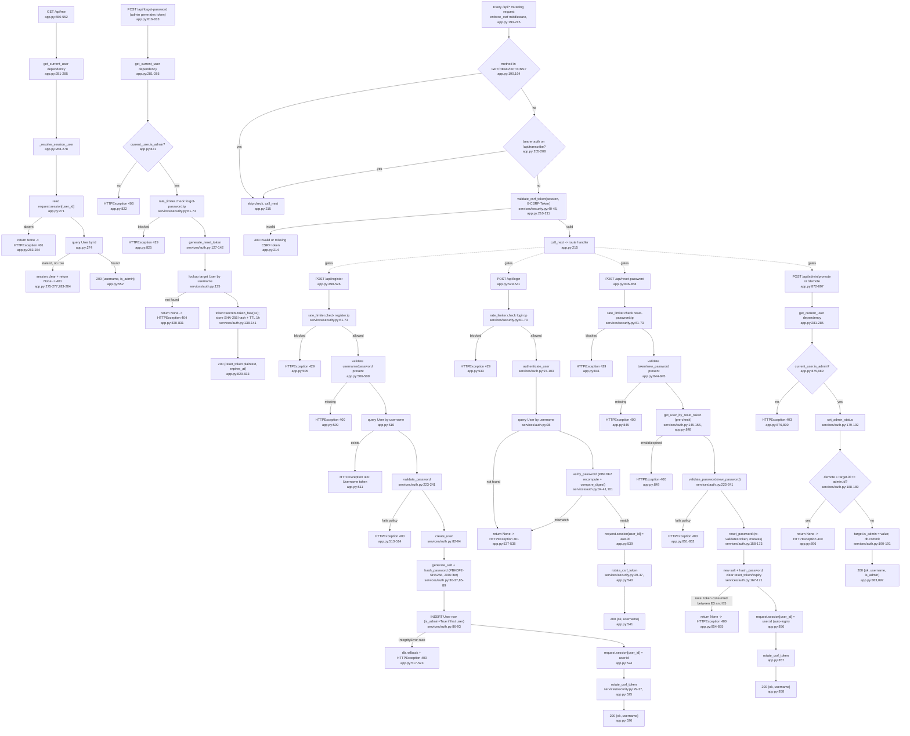

# Feature: auth-accounts

## Sources consulted
- `app.py` lines 1-60, 180-279, 280-315, 489-552, 800-931
- `services/auth.py` (full, 243 lines)
- `services/security.py` (full, 114 lines)
- `database/__init__.py` lines 1-31 (User model), 643-835 (init_db incl. first-user-auto-admin migration)

## Concrete findings
- Corrected line numbers vs Phase 0 guess: register app.py:499-526, login 529-541, /api/me 550-552, reset-password 836-858, admin routes 864-897, device-token routes 912-931. `/api/forgot-password` (admin-generates-reset-token) at 816-833, gated by `current_user.is_admin` inline, not a route dependency.
- CSRF enforced by global Starlette middleware `enforce_csrf` (app.py:193-215), executes after SessionMiddleware at request time; exempts bearer-token calls to `/api/transcribe`.
- `create_user` (auth.py:82-94) auto-admins first user in empty table; `init_db` (database/__init__.py:820-833) separately self-heals by promoting earliest user to admin if none exists — same `is_admin` field, two independent code paths writing it.
- `authenticate_user` (auth.py:97-103): single query + verify_password, no timing defense beyond that.
- Reset-password token checked twice: `get_user_by_reset_token` pre-check in route (app.py:848, prioritizes "bad token" error over "weak password" error) then again inside `reset_password` (auth.py:158-173) which mutates. Intentional double-check, not divergent logic.
- Rate limiting via shared in-process singleton `rate_limiter` (security.py:77) keyed `f"{route}:{client_ip}"`: register 5/300s, login 10/60s, forgot-username 5/300s, forgot-password 10/60s, reset-password 5/300s. No limit on /api/me or /api/admin/*.
- Device-token auth (`get_current_user_or_device`, app.py:300-314) is a sibling path used only by the upload route, not part of this feature's happy path — shares the User row/columns only.

## Mermaid flowchart

## External dependencies
- `database/__init__.py` `User` model (lines 17-30): sole persistence target for every mutation above.
- `database/__init__.py init_db` (lines 820-833): startup self-heal promoting earliest user to admin if none exists — feeds same `is_admin` field.
- `starlette.middleware.sessions.SessionMiddleware` (app.py:246) backs `request.session`, no external service call.
- No LlmJob/transcription queue interaction — auth-accounts is upstream (everything gates on `get_current_user`), never enqueues or reads a job.
- Device-token auth (`get_current_user_or_device`, app.py:300-314, backed by `set_device_token`/`get_user_by_device_token` in auth.py) shares User row/columns, separate entry path used only by the upload route.

## Confidence and gaps
High confidence, all line numbers verified from source (several Phase 0 guesses were off by a few lines). Did not expand `/api/csrf-token` (489-496), `/api/logout` (544-547), or `/api/admin/users` (GET list, 864-869) as separate flows — single-hop utility routes with no interesting branches. `encrypt_api_key`/`decrypt_api_key` in security.py confirmed unused by this feature (provider-config only).
