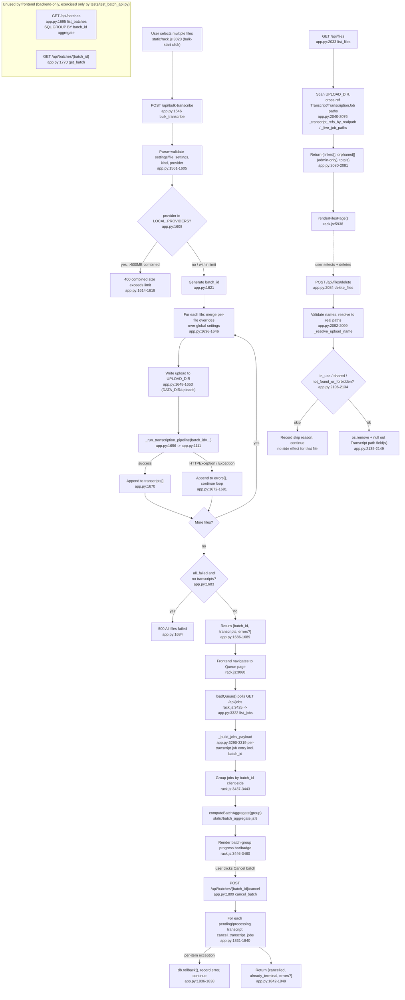

# Feature: batch-bulk-files

## Sources consulted
- `app.py:1546-1690` (bulk_transcribe, full), `1692-1850` (batch management: list_batches/get_batch/cancel_batch, full), `1852-2153` (search/transcripts/files routes, full)
- `app.py:1111-1250` (_run_transcription_pipeline, confirmed shared not batch-specific)
- `app.py:327-354` (_batch_latest_jobs, _serialize_transcript signatures), `3290-3335` (_build_jobs_payload / GET /api/jobs)
- `backends/__init__.py:37` (LOCAL_PROVIDERS)
- `static/batch_aggregate.js` full file (34 lines)
- `static/rack.js:3418-3480` (loadQueue), `3000-3067` (bulk-upload submit handler), `3578` (only frontend caller of /api/batches*), `5938-5958` (renderFilesPage)
- Grep across static/*.js for api/batches — no caller of GET /api/batches or GET /api/batches/{id}

## Definitive verdict: inline in app.py, no hidden service module
Confirmed: all three entry points fully inline in app.py, no services/batch*.py exists. The "feature" is really three bolted-together concerns:

1. **Bulk upload + per-file transcription** (bulk_transcribe, app.py:1546): thin loop around the SAME shared `_run_transcription_pipeline` (app.py:1111) used by single-file transcribe/retranscribe. No batch-specific transcription logic — batching only means generating one batch_id and stamping it on each Transcript row, plus per-file try/except so one failure doesn't abort the rest.
2. **Batch status aggregation is duplicated across two paths that never talk to each other**:
   - Backend: GET /api/batches / /api/batches/{id} (app.py:1695,1770), SQL GROUP BY batch_id aggregate. **Confirmed dead from the UI** — grep of all static/*.js shows no fetch to plain /api/batches or /api/batches/{id}. Only /api/batches/{id}/cancel is called (rack.js:3578). Exercised only by tests/test_batch_api.py (docstring calls them "Backend-only").
   - Frontend: `computeBatchAggregate` (static/batch_aggregate.js), invoked from loadQueue() (rack.js:3425-3467), groups the LIVE job list from GET /api/jobs client-side and computes counts/badges independently in JS. This is what actually renders the progress UI users see.
   - **Batch progress the user sees comes from client-side aggregation over /api/jobs, not the backend's /api/batches aggregate.** Two mirrored implementations (SQL case/sum vs JS for-loop) compute the same rollup; one is unused. Flagged as duplication (not an active bug — no divergence risk today since only one path is live).
3. **File management** (list_files/delete_files, app.py:2033/2084): unrelated concern sharing the route range — reconciles UPLOAD_DIR disk contents against Transcript/TranscriptionJob DB rows for linked vs orphaned files, no relation to batches.

## Side effects
- DB writes: bulk_transcribe -> each pipeline call creates/commits Transcript row (+TranscriptionJob rows for chunked audio) tagged with shared batch_id. cancel_batch calls cancel_transcript_jobs per transcript (db.rollback() on per-transcript failure). delete_files nulls out audio_path/video_path/stereo_audio_path columns and commits.
- File storage: uploads land in UPLOAD_DIR (DATA_DIR/uploads, flat), pipeline transcode/cleanup may rewrite save_path to a new file in same dir.
- Call into transcription-pipeline per batch item confirmed identical to single-file path, batch_id passed through only.

## Error/fallback branches
- Per-file: HTTPException/Exception from pipeline caught (1672-1681), appended to errors[] keyed by index/filename, loop continues.
- Whole-batch fail only if ALL files failed (all_failed and not transcripts, 1683) -> 500.
- Partial success: response always includes batch_id + transcripts; errors key only if non-empty.
- cancel_batch: per-transcript try/except + rollback, already_terminal counted separately from cancelled.
- delete_files: validates all filenames up front (rejects whole batch on bad name before any deletion), then per-file skip reasons (in_use, shared, not_found_or_forbidden, remove_failed).

## Mermaid flowchart

## External dependencies
- transcription-pipeline feature: `_run_transcription_pipeline` (app.py:1111) — the exact same function used by /api/transcribe and retranscribe. Batch adds nothing except passing batch_id through.
- chunked-queue/TranscriptionJob: touched indirectly via pipeline; directly by cancel_batch (cancel_transcript_jobs), file-deletion safety checks (_live_job_paths, _transcript_pipeline_can_resume).
- jobs/queue feature: GET /api/jobs (_build_jobs_payload) is the actual data source for the batch progress UI users see, not GET /api/batches.
- DB models: Transcript, TranscriptionJob, LlmJob (via _batch_latest_jobs, _serialize_transcript).
- backends registry: get_provider, LOCAL_PROVIDERS for provider validation/local-size gating.

## Confidence and gaps
High confidence on inline-vs-service verdict and dead-GET-/api/batches finding (grep-confirmed zero callers). Moderate confidence on _run_transcription_pipeline internals beyond signature/first ~140 lines — full body not read (transcription-pipeline's own territory). No batch_id-conditional branching observed in the portion read, but full ~600-line function not verified for this specifically.
