# Feature: chunked-queue

## Sources consulted
- `services/queue.py` full file (1-938)
- `database/__init__.py:85-125` (TranscriptionJob/LlmJob models), `630-680` (init_db, SQLite pragmas)
- `app.py:140-172` (lifespan), `1260-1378` (chunked-upload decision + create_chunk_jobs call site), `1805-1849` (cancel_batch), `2200-2299` (retry/cancel/resume/retranscribe routes)
- `backends/__init__.py:37-40` (LOCAL_PROVIDERS, get_provider signature, via grep)

## Job state machine
Column: `TranscriptionJob.status` (String(32), database/__init__.py:94). Inline model comment "# pending, running, completed, failed" is **stale/incomplete** — "cancelled" is a real, actively-used state (cancel_transcript_jobs:346, queried by resume_cancelled_chunks:373). No CHECK constraint, convention-only.

Transitions and exact sites:
- insert -> pending: create_chunk_jobs:254-260
- pending -> running: _run_chunk_job:456-458 (attempts+=1, committed BEFORE provider await — concurrency-safety invariant documented 443-453)
- running -> completed: silent-audio short-circuit (492-497) or normal success (537)
- running -> failed: provider exception (549-550)
- running -> failed (crash recovery): reset_stuck_transcription_jobs:427-430, run once at startup (app.py:156)
- failed -> pending (auto-retry): queue_worker_tick:819-822, gated by _retry_eligible:435-440 (attempts<MAX_ATTEMPTS=3, backoff min(60,5*2**attempts) since updated_at). **Does not reset attempts** — makes 3 attempts terminal.
- failed -> pending (manual): retry_failed_chunks:313-315, resets attempts=0, clears error
- pending -> cancelled: cancel_transcript_jobs:346 (running jobs deliberately left alone)
- cancelled -> pending: resume_cancelled_chunks:376-379, resets attempts=0
- Nothing moves a running job directly to cancelled — a job in flight when cancel fires keeps running to completed/failed, and _finalize_if_done's transcript-level cancelled check (571-582) discards that result.

Parent Transcript.status mirrors but is decided independently: cancel sets it to 'cancelled' immediately regardless of per-job state (349-351); _finalize_if_done computes completed/failed/partial from job counts only once no job is pending/running (586-593), unless already cancelled which always wins (571-582).

## Worker tick cycle (queue_worker_tick, 788-889)
1. Query all jobs status in (pending, failed) (812-816).
2. Resurrect retry-eligible failed jobs to pending, flip transcript to processing unless cancelled (818-832).
3. Group remaining pending jobs by transcript_id (834-837).
4. Also collect every transcript currently processing even with zero pending jobs this tick (processing_ids, 846-849) — needed so a transcript stuck with only a running job still gets finalize-checked once that job completes.
5. `asyncio.gather(*_process_transcript_jobs(...), return_exceptions=True)` — one coroutine per transcript, sharing ONE DB session opened at tick top (810), run concurrently (862-869).
6. Inside _process_transcript_jobs (714-785): compute concurrency cap (local providers forced to 1, hosted from user settings, 729-737), compute free slots (739-746), decrypt provider API key (748-766), walk pending jobs in chunk-index order calling has_budget per job, stop at first that would exceed budget (768-774) — remaining stay pending. Dispatched jobs run via a SECOND inner asyncio.gather (780-783) over _run_chunk_job.
7. _run_chunk_job (454-551): commit running+attempts++ before the only await (provider .transcribe(), 512/514), optionally serialized behind a per-tick asyncio.Semaphore(1) for local providers (511, fresh per tick at 860 to avoid cross-event-loop binding issues), then commit completed/failed.
8. _finalize_if_done runs after every _process_transcript_jobs (785) and again for processing-but-not-dispatched transcripts at tick end (880-887).
9. Loop sleeps 5s (interval_seconds default, 892,900), repeats until lifespan shutdown cancels the task (app.py:163).

## Finalize logic (_finalize_if_done, 554-711)
Bails early if any job still pending/running (564-565), or transcript already cancelled (571-582, cancellation always wins, never overwritten). Otherwise merges completed jobs' segments via merge_chunk_results (212-244, dedupes duplicate text at chunk boundaries via _is_duplicate_boundary), computes new_status from failed/completed counts (588-593), then gates expensive/destructive side effects (diarization, clear_relabel_history, segment/full_text overwrite, LLM job enqueue volley) behind `should_fire_side_effects = full_text != transcript.full_text` (602) so a chunk retry producing byte-identical merged text doesn't re-run paid diarization or wipe user edits (issue #328). Transcript's status/updated_at still update unconditionally (674-676) even when side effects skipped. Diarization branch explicitly rolls back before its own await and re-fetches/re-checks for concurrent cancel afterward (607-658), required so a concurrent /cancel on a separate session is actually observed rather than shadowed by this session's own uncommitted autoflush.

## Concurrency / locking
- All coroutines within one tick share a single db session (opened at queue_worker_tick:810), safe only because every write commits before its one await point — explicit "SAFETY INVARIANT" comment (443-453), reiterated 776-779, 793-808.
- **No queue-level retry/backoff exists anywhere in queue.py for OperationalError/"database is locked."** Mitigation is entirely engine-layer: journal_mode=WAL, busy_timeout=5000, synchronous=NORMAL (database/__init__.py:661-672, tied to issue #66), plus pool_size=10/max_overflow=20 (654-659). If a commit raised a lock error inside _run_chunk_job, it would escape the try/except (486/539, commit at 551 is outside that block), propagate up — and since the **inner** asyncio.gather at 780-783 lacks return_exceptions=True (unlike the two outer gathers at 863-869/881-884 which do), could strand a sibling job at status='running' forever. Recovery only via reset_stuck_transcription_jobs at next restart, not automatic. **Latent gap, not fixed here (investigation only).**
- Rate-limit budget tracking (compute_audio_seconds_used:28-81, has_budget:84-95) sums audio-seconds from completed/partial parent Transcripts and in-flight TranscriptionJob rows over trailing 1h/24h windows per user+provider, hardcoded PROVIDER_LIMITS (currently only groq) with DEFAULT_LIMITS fallback; local providers always pass (88-91).

## Mermaid flowchart

```mermaid
flowchart TD

  subgraph ENQ["Enqueue path: create_chunk_jobs"]
    E1["POST /api/transcripts (upload)<br/>app.py:~1200-1298"]
    E2["hosted_chunked / local_chunked decision<br/>app.py:1295-1296"]
    E3["chunk_audio()<br/>services/audio_prep.py:308"]
    E4["create_transcript_stub()<br/>app.py:1315 or 1346"]
    E5["create_chunk_jobs(db, transcript_id, chunks)<br/>services/queue.py:250-261"]
    E6["INSERT TranscriptionJob rows, status='pending'<br/>services/queue.py:254-260"]
    E7["db.commit()<br/>services/queue.py:261"]
    E1 --> E2 --> E3 --> E4 --> E5 --> E6 --> E7
  end

  subgraph WRK["Dispatch / execute / finalize path: queue_worker_loop"]
    W0["app.py lifespan startup<br/>app.py:153-164"]
    W0a["reset_stuck_transcription_jobs()<br/>services/queue.py:421-432<br/>(startup only, running to failed)"]
    W1["queue_worker_loop()<br/>services/queue.py:892-900<br/>while True, interval=5s"]
    W2["queue_worker_tick()<br/>services/queue.py:788-889"]
    W3["Query jobs status IN (pending, failed)<br/>services/queue.py:812-816"]
    W4{"job.status=='failed'<br/>and _retry_eligible(job)?<br/>services/queue.py:435-440,819"}
    W5["job.status='pending', error=None<br/>backoff min(60, 5*2^attempts) elapsed<br/>services/queue.py:820-821"]
    W6["transcript.status='processing' (if not cancelled)<br/>services/queue.py:824-831"]
    W7["Group pending jobs by transcript_id<br/>services/queue.py:834-837"]
    W8["asyncio.gather over _process_transcript_jobs per transcript<br/>services/queue.py:862-869<br/>return_exceptions=True"]
    W9["_process_transcript_jobs()<br/>services/queue.py:714-785"]
    W10["Compute concurrency_cap<br/>local provider=1, else settings.max_concurrent_chunks<br/>services/queue.py:729-737"]
    W11["slots = cap - already_running<br/>services/queue.py:739-746"]
    W12{"has_budget(db,user,provider,job_duration)?<br/>services/queue.py:84-95,772"}
    W13["Job stays pending, break<br/>rate-limited / budget exhausted<br/>services/queue.py:773"]
    W14["asyncio.gather over _run_chunk_job (dispatched)<br/>services/queue.py:780-783<br/>NOTE: no return_exceptions=True here"]
    W15["_run_chunk_job()<br/>services/queue.py:454-551"]
    W16["job.status='running', attempts+=1, db.commit()<br/>services/queue.py:456-458"]
    W17{"is_silent_audio(job.audio_path)?<br/>services/queue.py:488-492"}
    W18["result_json=empty segments, status='completed'<br/>services/queue.py:493-497"]
    W19["get_provider(provider_name,cfg).transcribe()<br/>services/queue.py:499-514<br/>local provider serialized via asyncio.Semaphore(1)"]
    W20["filter_hallucinations() if enabled<br/>services/queue.py:516-525"]
    W21["job.result_json=..., status='completed', error=None<br/>services/queue.py:527-538"]
    W22["except ProviderError/Exception:<br/>job.status='failed', job.error=str(e)<br/>services/queue.py:539-550"]
    W23["db.commit()<br/>services/queue.py:551"]
    W24["_finalize_if_done(db, transcript_id, diarization_service)<br/>services/queue.py:554-711 (called at 785)"]
    W25{"any job pending/running?<br/>services/queue.py:564"}
    W26["return, still work outstanding<br/>services/queue.py:565"]
    W27{"transcript.status=='cancelled'?<br/>services/queue.py:571-582"}
    W28["return, cancellation wins<br/>discard in-flight results<br/>services/queue.py:582"]
    W29["merge_chunk_results(jobs)<br/>services/queue.py:212-244,584"]
    W30["Compute new_status: completed/failed/partial<br/>services/queue.py:586-593"]
    W31{"should_fire_side_effects =<br/>full_text != transcript.full_text?<br/>services/queue.py:602"}
    W32["Diarization branch (if diarize_requested)<br/>db.rollback() before await, re-fetch after<br/>services/queue.py:607-658"]
    W33{"transcript still not cancelled<br/>after diarization await?<br/>services/queue.py:653"}
    W34["clear_relabel_history, write segments/full_text/duration/speaker_count<br/>services/queue.py:659-673"]
    W35["transcript.status=new_status, updated_at=now, db.commit()<br/>services/queue.py:674-676"]
    W36["Enqueue LLM jobs: auto_correction/classify/voice_note/voice_dump/tagging<br/>services/llm_jobs.py via services/queue.py:678-709"]
    W37["_cleanup_completed_chunk_files(jobs)<br/>services/queue.py:264-301,711"]
    W38["Finalize-check remaining processing transcripts<br/>with no pending jobs this tick<br/>services/queue.py:846-887"]
    W39["asyncio.sleep(interval_seconds)<br/>services/queue.py:900, loop repeats"]

    W0 --> W0a --> W1 --> W2 --> W3 --> W4
    W4 -->|yes| W5 --> W6
    W4 -->|no| W7
    W6 --> W7
    W7 --> W8 --> W9 --> W10 --> W11 --> W12
    W12 -->|no| W13
    W12 -->|yes| W14 --> W15 --> W16 --> W17
    W17 -->|yes| W18
    W17 -->|no| W19 --> W20 --> W21
    W19 -.->|raises| W22
    W18 --> W23
    W21 --> W23
    W22 --> W23
    W23 --> W24
    W13 --> W24
    W24 --> W25
    W25 -->|yes| W26
    W25 -->|no| W27
    W27 -->|yes| W28
    W27 -->|no| W29 --> W30 --> W31
    W31 -->|yes, diarize requested| W32 --> W33
    W33 -->|cancelled mid-await| W28
    W33 -->|no| W34 --> W35
    W31 -->|no diarize| W35
    W31 -->|no, text unchanged: issue #328 skip| W35
    W35 --> W36 --> W37
    W38 --> W2
    W37 --> W39 --> W2
  end

  E7 -.->|shared TranscriptionJob table<br/>next tick's query at :812-816| W3

  subgraph SIDE["Side entry points (also mutate TranscriptionJob/Transcript)"]
    S1["POST /transcripts/{id}/retry-failed-chunks<br/>app.py:2204-2212"]
    S2["retry_failed_chunks()<br/>failed->pending, attempts=0, error=None<br/>services/queue.py:304-322"]
    S3["POST /transcripts/{id}/cancel<br/>app.py:2215-2225"]
    S4["POST /batches/{batch_id}/cancel<br/>app.py:1809-1849 (per-transcript loop)"]
    S5["cancel_transcript_jobs()<br/>pending->cancelled, transcript->'cancelled'<br/>services/queue.py:325-353"]
    S6["POST /transcripts/{id}/resume<br/>app.py:2228-2238"]
    S7["resume_cancelled_chunks()<br/>cancelled->pending, attempts=0<br/>transcript->'processing' if was cancelled<br/>services/queue.py:356-386"]
    S8["POST /transcripts/{id}/retranscribe<br/>app.py:2241-2299 (new transcript row,<br/>re-enters upload pipeline -> ENQ)"]
    S1 --> S2 -.->|feeds back into W3 next tick| W3
    S3 --> S5
    S4 --> S5
    S5 -.->|removes rows from W3's pending pool| W3
    S6 --> S7 -.->|feeds back into W3 next tick| W3
    S8 -.-> E1
  end
```

## External dependencies
- backends/: get_provider (backends/__init__.py:40, called queue.py:499), ProviderError (queue.py:15, caught 539), LOCAL_PROVIDERS=("builtin","moonshine") (37, used 87,500,729,905), provider.transcribe() (called 512,514).
- database/: Transcript, TranscriptionJob, ProviderConfig models, utcnow_naive().
- Cross-service calls inline-imported: services.settings.get_user_settings/_decrypt_key_if_needed, services.audio_prep.is_silent_audio, services.audio_cleanup.filter_hallucinations, services.relabel.clear_relabel_history/count_distinct_speakers, services.llm_jobs.enqueue_auto_*, services.classification.effective_kind, services.pricing.get_provider_stt_rate.

## Confidence and gaps
High confidence — entire file read start to finish, all given line numbers verified. backends/__init__.py and audio_prep.py:chunk_audio located by grep not read in full (out of scope, queue.py is the core). Two source-comment inaccuracies found (not fixed, investigation only): (1) TranscriptionJob.status comment omits "cancelled"; (2) queue.py:826 cites a stale self-reference. One structural gap flagged for follow-up: inner asyncio.gather at 780-783 lacks return_exceptions=True unlike outer gathers, could strand a sibling job at running on an unhandled commit exception. No queue-level SQLite lock retry/backoff exists — confirmed by full-file inspection.
