# Feature: classification-tagging

## Sources consulted
- `services/classification.py` full file (1-86)
- `services/tagging.py` full file (1-149)
- `services/llm_jobs.py:1-340,383-420,420-500,480-660,1000-1081`
- `database/__init__.py:195-260,440-490,640-830`
- `app.py:1111-1170,1430-1472,2085-2100,2154-2205,2242-2290`
- `services/queue.py:670-712`
- `services/llm_client.py` grep for def/async def
- Grep across repo (excluding tests) for `classification_status = "pending"` assignments

## Concrete findings
**Trigger and dispatch.** classification_status="pending" is set from FIVE sites, not zero — the llm_jobs.py:296-299 docstring claiming "nothing sets this yet" is **stale**:
- app.py:1163-1165 inside _run_transcription_pipeline (kind="auto" upload)
- app.py:2178-2191 (update_transcript PATCH, kind->"auto", calls enqueue_pipeline_classify directly)
- app.py:2273-2285 (retranscribe_transcript, re-auto for prior success/uncertain/failed)
- Both finalize sites (app.py:1450-1462, services/queue.py:690-700) fall back to calling enqueue_pipeline_classify directly when auto_correct is off

The two finalize call sites are declared mirrors ("keep this site in lockstep") but differ: app.py:1450-1451 takes a caller-supplied auto_correct override before falling back to settings; services/queue.py:690 reads settings only, and services/queue.py:678 additionally gates the whole block on should_fire_side_effects, which app.py has no equivalent of.

**Happy path.** _run_transcription_pipeline/_finalize_if_done -> enqueue_auto_correction (llm_jobs.py:180) -> llm_worker_tick/llm_worker_loop (1009,1073, started app.py:161) -> run_llm_job correction branch (444) -> correct_transcript writes corrected_text -> on completion, enqueue_pipeline_classify (294, called at 480) no-ops unless classification_status=="pending" -> run_llm_job classify_pipeline branch (542) -> classify_pipeline_kind (classification.py:46) -> chat_completion (llm_client.py:69) -> confidence-gated write of classification_status/kind (llm_jobs.py:569-579). Independently, enqueue_auto_classify (gated on effective_kind()=="dictation") and enqueue_auto_tagging (unconditional, every kind) both fire from the same two finalize sites (app.py:1463,1470, queue.py:701,709).

**Tagging.** run_llm_job tagging branch (597) -> generate_tags (tagging.py:102) -> chat_completion, wrapped in try/except that never raises (129-143) -> _extract_json_object/_normalize (56,76) -> **DELETE all existing TranscriptTag rows for the transcript, then INSERT the fresh set** (llm_jobs.py:616-620, database/__init__.py:220 model, composite PK transcript_id+tag).

**Side effects/DB writes**: Transcript.classification_status/_confidence/_provenance/kind (database/__init__.py:40,45-47), TranscriptTag replace-not-append (llm_jobs.py:616-620), LlmJob.result_json for both job kinds. LLM calls through llm_client.py:chat_completion for both classify_pipeline and tagging jobs — two independent LLM calls per transcript life cycle (never bundled).

**Retry.** classify_pipeline and tagging both in AUTO_RETRY_KINDS (llm_jobs.py:37) — a failed job becomes eligible for the eligible_failed/_retry_eligible sweep in llm_worker_tick (1012-1036), flipped back to pending, re-run. classify_pipeline_kind's explicit "raise rather than guess" design (classification.py:6-10) exists specifically to make this retry sweep the correction mechanism for a bad/failed classification.

**Dead branch found:** run_llm_job:593 fires enqueue_auto_voice_dump when result["kind"]=="voice_dump", but classify_pipeline_kind validates against CLASSIFICATION_KINDS=("meeting","dictation","voice_note") (classification.py:20) and raises ValueError on anything else (81-82) — the classifier can never actually return "voice_dump", so that branch is currently unreachable from this path (voice_dump presumably reaches its kind only via explicit/manual selection).

**Legacy migration.** "Legacy scheme" = pre-issue-#267 transcripts predating the classification_provenance column entirely. classification_columns_were_absent (database/__init__.py:448) called once, right after create_all() and before ensure_columns() adds the three classification columns (679-681) — the only moment absence is observable. backfill_legacy_classification (463, invoked at 818) does a single one-time bulk UPDATE, converting every pre-existing row to classification_status="override" with classification_provenance={"legacy_migration": true} — never retroactively classified, treated as a permanent manual choice (design decision 7).

## Mermaid flowchart

```mermaid
flowchart TD

subgraph TRIGGER["Trigger sites (kind=auto sets classification_status=pending)"]
  N1["_run_transcription_pipeline()<br/>app.py:1111 (kind==auto branch app.py:1163-1165)"]
  N2["transcribe_audio() / bulk_transcribe()<br/>app.py:1483, 1547 (inline finalize)"]
  N3["_finalize_if_done()<br/>services/queue.py:678 (chunked finalize, gated on should_fire_side_effects)"]
  N4["update_transcript() PATCH kind=auto<br/>app.py:2154 (sets pending directly, app.py:2178-2191)"]
  N5["retranscribe_transcript()<br/>app.py:2242 (source status success/uncertain/failed to re-auto, app.py:2273-2285)"]
end

N2 --> N1
N5 --> N1
N1 --> N6["Transcript row<br/>kind='meeting' placeholder<br/>classification_status='pending'<br/>database/__init__.py:40,45-47"]
N3 --> N6

N6 --> N7{"auto_correct setting?"}
N1 -.-> N7
N3 -.-> N7
N7 -- "true" --> N8["enqueue_auto_correction()<br/>services/llm_jobs.py:180<br/>creates LlmJob(kind='correction')"]
N7 -- "false" --> N9["enqueue_pipeline_classify() direct fallback<br/>app.py:1462 / services/queue.py:700"]
N4 --> N9b["enqueue_pipeline_classify() direct call<br/>app.py:2191"]

N8 --> N10["llm_worker_loop() / llm_worker_tick()<br/>services/llm_jobs.py:1073,1009<br/>claims pending, marks running"]
N10 --> N11["run_llm_job() kind='correction'<br/>services/llm_jobs.py:414,444"]
N11 --> N12["correct_transcript()<br/>services/correction.py<br/>writes transcript.corrected_text"]
N12 --> N13{"result == ok?"}
N13 -- "yes" --> N14["_finish completed<br/>services/llm_jobs.py:383,462-464"]
N14 --> N9c["enqueue_pipeline_classify()<br/>services/llm_jobs.py:294,480<br/>no-ops unless classification_status=='pending'"]
N13 -- "failed" --> N15["_finish failed<br/>services/llm_jobs.py:482"]
N15 --> N9c

N9 --> N9c
N9b --> N9c
N9c --> N16["LlmJob(kind='classify_pipeline') pending<br/>database TranscriptTag/LlmJob table"]
N16 --> N10

N10 --> N17["run_llm_job() kind='classify_pipeline'<br/>services/llm_jobs.py:542"]
N17 --> N18["classify_pipeline_kind()<br/>services/classification.py:46<br/>builds prompt from corrected_text/full_text/segments (line 40-43)"]
N18 --> N19["chat_completion()<br/>services/llm_client.py:69<br/>LLM call, json_mode, temperature=0"]
N19 --> N20{"valid kind in<br/>CLASSIFICATION_KINDS<br/>(meeting/dictation/voice_note only)<br/>classification.py:20,81-82?"}
N20 -- "no / provider error" --> N21["raise ValueError/RuntimeError<br/>classification.py:56,82,84"]
N21 --> N22["except in run_llm_job<br/>services/llm_jobs.py:554<br/>transcript.classification_status='failed'<br/>_finish failed"]
N22 --> N23["AUTO_RETRY_KINDS sweep<br/>services/llm_jobs.py:37,1012-1036<br/>eligible_failed -> pending retry"]
N23 --> N10
N20 -- "yes" --> N24{"confidence >= threshold?<br/>services/llm_jobs.py:569<br/>(classification_confidence_threshold, default 0.75)"}
N24 -- "yes" --> N25["transcript.classification_status='success'<br/>transcript.kind=result.kind<br/>services/llm_jobs.py:570,579"]
N24 -- "no" --> N26["transcript.classification_status='uncertain'<br/>kind NOT updated<br/>services/llm_jobs.py:570,578"]
N25 --> N27["job.result_json={kind,confidence,accepted}<br/>_finish completed<br/>services/llm_jobs.py:581,596"]
N26 --> N27
N27 --> N28{"accepted and kind==voice_note?<br/>services/llm_jobs.py:590"}
N28 -- "yes" --> N29["enqueue_auto_voice_note()<br/>services/llm_jobs.py:221,592<br/>gated via effective_kind()"]
N27 --> N30{"accepted and kind==voice_dump?<br/>services/llm_jobs.py:593<br/>UNREACHABLE: classifier never returns voice_dump"}
N30 -. "dead branch" .-> N31["enqueue_auto_voice_dump()<br/>services/llm_jobs.py:248"]

N6 --> N32["enqueue_auto_classify()<br/>services/llm_jobs.py:197<br/>gated: effective_kind()=='dictation'<br/>app.py:1463 / services/queue.py:701"]
N32 --> N33["effective_kind()<br/>services/classification.py:23<br/>returns transcript.kind only if<br/>status in (success, override), else None"]

N6 --> N34["enqueue_auto_tagging()<br/>services/llm_jobs.py:275<br/>fires unconditionally for every kind<br/>app.py:1470 / services/queue.py:709"]
N34 --> N35["LlmJob(kind='tagging') pending"]
N35 --> N10
N10 --> N36["run_llm_job() kind='tagging'<br/>services/llm_jobs.py:597"]
N36 --> N37["generate_tags()<br/>services/tagging.py:102<br/>text = corrected_text or full_text or segments (line 117-122)"]
N37 --> N38["chat_completion()<br/>services/llm_client.py:69<br/>json_mode, never raises (try/except services/tagging.py:129-143)"]
N38 --> N39["_extract_json_object() + _normalize()<br/>services/tagging.py:56,76<br/>dedupe/lowercase/trim/cap 5 tags, len 2-64"]
N39 --> N40["DELETE existing TranscriptTag rows<br/>services/llm_jobs.py:616-618<br/>then INSERT new TranscriptTag rows<br/>database/__init__.py:220 (PK transcript_id+tag)"]
N40 --> N41["job.result_json={tags}<br/>_finish completed<br/>services/llm_jobs.py:621-623"]
N41 -.-> N23

subgraph LEGACY["Legacy migration path (startup, one-time)"]
  L1["init_db()<br/>database/__init__.py:643<br/>called from app.py:113 module load"]
  L1 --> L2["Base.metadata.create_all(engine)<br/>database/__init__.py:675"]
  L2 --> L3["classification_columns_were_absent()<br/>database/__init__.py:448<br/>captured BEFORE ensure_columns adds the columns"]
  L3 --> L4{"'classification_provenance'<br/>column missing?<br/>database/__init__.py:460"}
  L4 -- "no (fresh DB / already migrated)" --> L5["was_absent = False"]
  L4 -- "yes (pre-#267 DB)" --> L6["was_absent = True"]
  L5 --> L7["ensure_columns() adds classification_status<br/>DEFAULT 'override', classification_confidence,<br/>classification_provenance<br/>database/__init__.py:681"]
  L6 --> L7
  L7 --> L8["backfill_legacy_classification(SessionLocal, was_absent)<br/>database/__init__.py:463,818"]
  L8 --> L9{"was_absent?"}
  L9 -- "False" --> L10["return 0, no-op<br/>database/__init__.py:475-476"]
  L9 -- "True" --> L11["UPDATE every Transcript row<br/>classification_status='override'<br/>classification_provenance={legacy_migration: true}<br/>database/__init__.py:479-486<br/>(one-time only; run() flag prevents re-trigger on restart)"]
end

L11 -.->|"legacy rows now permanently<br/>'override' - never auto-reclassified"| N6
```

## External dependencies
LLM provider APIs via llm_client.py:chat_completion (2 independent calls per transcript: classify_pipeline, tagging). SQLAlchemy/SQLite: Transcript, LlmJob, TranscriptTag tables. asyncio background loop started from FastAPI lifespan. services/correction.py (correct_transcript) upstream of classification, gates when classify_pipeline fires. services/settings.py (resolve_provider_key, KEYLESS_PROVIDERS, get_user_settings) for key/skip logic in every enqueue helper.

## Confidence and gaps
High confidence, all verified by direct read. Two corrections to Phase 0 framing flagged: (1) llm_jobs.py:296-299 docstring "nothing sets classification_status='pending' yet" is stale — five call sites do; (2) voice_dump auto-trigger branch (593) is dead code since classify_pipeline_kind cannot return "voice_dump". Not chased further: services/correction.py:correct_transcript internals, services/voice_notes.py:run_voice_note_chain — both outside declared scope, included only as opaque call targets.
