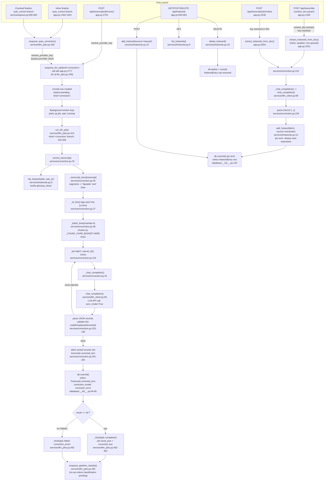

# Feature: correction-hotwords

## Sources consulted
- `app.py`: 945-964 (hotword CRUD), 1435-1460 (inline post-transcription auto-correct trigger), 1480-1530 (upload route + context_doc extraction), 2754-2778 (manual /correct route), 3220-3291 (context-attach route, correction-models route)
- `services/correction.py` full file (1-239)
- `services/hotwords.py` full file (1-44)
- `database/__init__.py` 33-66 (Transcript.corrected_text/correction_error/correction_model), 140-147 (HotwordEntry model)
- `services/llm_jobs.py` 100-194, 280-347, 414-494
- `services/llm_client.py` 69-128
- `services/queue.py` 675-699 (chunked-finalize auto-correct enqueue)

## Concrete findings
- **Duplication question answered**: `correct_transcript` has exactly ONE call site in the whole codebase: `services/llm_jobs.py:457`, inside `run_llm_job`'s `kind == "correction"` branch. Neither the manual route nor auto-correct paths call it directly — all three (manual route app.py:2754, inline-finalize app.py:1453, chunked-finalize queue.py:693) converge through `enqueue_llm_job`/`enqueue_auto_correction` into one `LlmJob` row. correction-hotwords is a pure client of llm-job-queue, not a parallel implementation.
- The two auto-correct call sites (app.py:1453, queue.py:693) are themselves near-duplicate (identical framing comments referencing "design decision 11") but within this feature's own boundary, not a competing job-queue implementation.
- Hotword-extraction is a separate inline (non-queued) side flow: `extract_hotwords_from_doc` called directly and awaited from two entry points — upload-time context_doc (app.py:1515-1528, swallows exceptions silently) and explicit context route (app.py:3236-3273, raises 502 on failure).
- LLM calls route through module-local `_chat_completion` wrapper (correction.py:32) → `services/llm_client.py:69 chat_completion`, feature_name="Correction".
- `_batch_lines` (correction.py:58) chunks transcript lines by `_CHUNK_CHAR_BUDGET=6000` chars with 4-line overlap; each line tagged `[Lnnnn]` by `_id_line` (correction.py:27) so LLM output can be validated/re-stitched (valid/misplaced/invented ID checks, correction.py:153-199).

## Mermaid flowchart

## External dependencies
- llm-job-queue feature: sole path to `correct_transcript` execution (via LlmJob row + worker loop).
- `services/llm_client.py chat_completion`: shared LLM call plumbing (also used by reformatting, tagging, voice_notes, assistant).
- classification-tagging feature: `enqueue_pipeline_classify` handoff after correction completes.
- `database/__init__.py` Transcript and HotwordEntry models.

## Confidence and gaps
High confidence — every node verified against source, not inferred; the single-call-site claim confirmed by whole-repo grep. Did not diagram the LLM worker loop's job-claiming/retry mechanics (belongs to llm-job-queue), classification pipeline internals (separate feature), or frontend call sites (out of scope). Omitted queue.py:690-699's "auto_correct disabled" fallback branch as minor.
