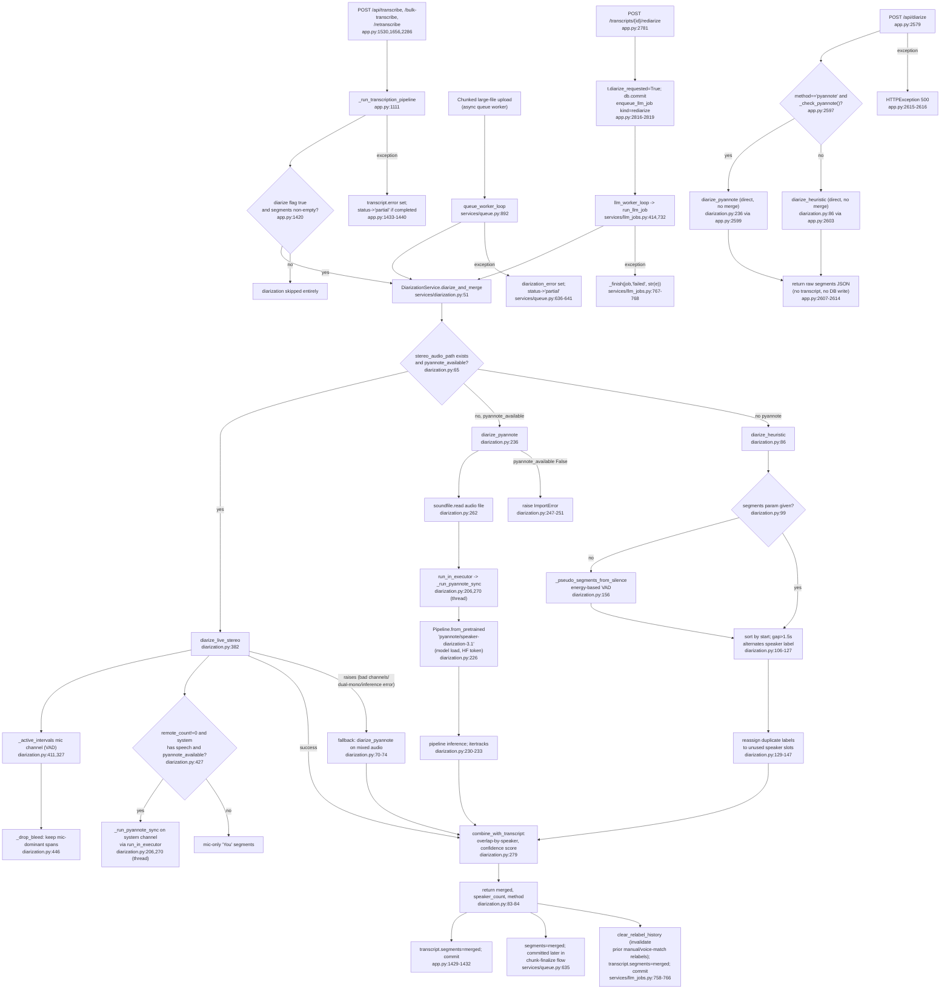

# Feature: diarization

## Sources consulted
- `services/diarization.py` full file (1-465)
- `app.py:2577-2617` (POST /api/diarize), `2781-2820` (POST rediarize), `1111-1150,1380-1441` (_run_transcription_pipeline inline call), `150,160-161,594,975` (wiring), `1483,1547,1656,2242,2286` (pipeline callers)
- `services/llm_jobs.py:23,29,45,414,700-768,1009-1077` (rediarize job kind)
- `services/queue.py:592-644` (chunked-upload worker, second inline caller)
- `services/relabel.py:20,101` (signatures only)

## Concrete findings
- **Mode selection is auto-detect via `_check_pyannote()` (eager try/import probe), not a config flag.** Two independent selection points:
  1. `DiarizationService.diarize_and_merge` (diarization.py:51-84) — merge-aware path for all "attach to transcript" callers. Priority: stereo_audio_path given+exists+pyannote available -> `diarize_live_stereo` (382), any exception inside falls back to `diarize_pyannote` on mixed audio (70-74); else pyannote available -> `diarize_pyannote` (236); else -> `diarize_heuristic` (86), forcing num_speakers or 2. Result always passed through `combine_with_transcript` (279) for time-overlap merge.
  2. `POST /api/diarize` (app.py:2579-2616) — simpler explicit-param selector, does NOT go through diarize_and_merge: method=="pyannote" and check -> diarize_pyannote directly, else diarize_heuristic directly. No live-stereo, no transcript merge (standalone file, raw segments).
- **Four call sites feed diarize_and_merge** (Phase 0 only knew of two):
  - app.py:1422 inside `_run_transcription_pipeline` (1111), itself called from transcribe_audio (1530), bulk_transcribe (1656), retranscribe_transcript (2286) — inline, synchronous.
  - services/queue.py:630 inside chunked-upload background queue worker.
  - services/llm_jobs.py:744 inside run_llm_job's kind=="rediarize" branch (732-768), enqueued by POST /rediarize (app.py:2819).
- Side effects: audio reads via soundfile (diarize_pyannote:262, diarize_live_stereo:396); model load `Pipeline.from_pretrained("pyannote/speaker-diarization-3.1", token=...)` inside `_run_pyannote_sync` (226), **reloaded every call, no caching** — network+disk load each invocation; blocking work offloaded via `loop.run_in_executor` (270, 434). DB writes happen only in callers, never in diarization.py itself.
- rediarize specifically calls `clear_relabel_history(db, transcript.id)` before overwriting segments (llm_jobs.py:758) since re-diarization invalidates prior manual relabels/voice-match results (index-based).
- Error/fallback: pyannote unavailable -> diarize_and_merge short-circuits to heuristic (never calls pyannote path); direct diarize_pyannote call with pyannote unavailable raises ImportError (247-251). diarize_live_stereo raises ValueError for <2 channels (398) or dual-mono identical channels (406-409), caught by diarize_and_merge's try/except, falls back to mixed-audio pyannote (not heuristic).

## Mermaid flowchart

## External dependencies
- app.py routes: /api/transcribe, /bulk-transcribe, /retranscribe all via shared `_run_transcription_pipeline` calling diarize_and_merge inline.
- POST /api/diarize: standalone, calls diarize_pyannote/diarize_heuristic directly, no transcript context.
- POST rediarize: enqueues LlmJob(kind="rediarize"), picked up by llm_worker_loop.
- services/queue.py:892 queue_worker_loop: fourth caller of diarize_and_merge (chunked large-file background transcription), found via diarization_service parameter threading, not in Phase 0's original scope note.
- After rediarize completes, clear_relabel_history invalidates prior relabels; separate voice_match job kind (llm_jobs.py:769, entry POST voice-match app.py:2823) runs independently afterward — this is the voice-id-match feature boundary, not traced further.

## Confidence and gaps
High confidence on diarization.py internals (full file read) and mode-selection/fallback chain. Two call sites beyond Phase 0's scope note discovered and included (queue.py chunked-upload worker; bulk_transcribe/retranscribe as additional _run_transcription_pipeline callers) — flagging for Phase 0 inventory correction. Did not open services/voice_id.py, services/relabel.py beyond signatures, or static/rack.js. Did not verify enqueue_llm_job internals beyond call site/effect.
