# Feature: providers-settings-cost

## Sources consulted
- `app.py:982-1107` (providers list/get/put/models), `2760-2778,3254-3291` (key-resolve call sites), `3695-3770` (cost routes)
- `services/settings.py` full file (151 lines)
- `services/model_catalog.py` full file (160 lines)
- `services/pricing.py` full file (55 lines)
- `services/cost.py` full file (161 lines)
- `database/__init__.py:273-285` (ProviderConfig)
- `services/queue.py:903-933` (get_rate_limit_gauge)
- `services/security.py:93,106` (encrypt/decrypt signatures only)
- `static/rack.js:1488-1522,2172-2210,3624-3630,5574-5596,6124-6132,6329-6363` (frontend call sites)

## Concrete findings
**(a) Provider key storage/retrieval**
- Write: PUT /api/providers/{name} (app.py:1031) upserts ProviderConfig, calling `encrypt_api_key()` before storing, then commit (1055). Masked-value guard: incoming value starting with "••••" treated as unchanged, skipped (1042).
- Read (masked, UI): GET /api/providers/{name} (1012) shows only "••••"+last4 (1023), never decrypts.
- Read (real, for use): `resolve_provider_key()` (settings.py:90) is "the one place API keys are drawn from." Queries ProviderConfig, reads session secret from `<data>/.session_secret`, calls `_decrypt_key_if_needed()` (72) which delegates to `decrypt_api_key()` only if stored value looks encrypted (len >= 64); short values assumed legacy plaintext, returned as-is. Called from many job-kickoff sites (app.py ~2640,2685,3017,3045,3393, and correction rerun 2772, context-extraction 1519,3254-3257).

**(b) Model catalog fetch**
- Transcription models: GET /api/providers/{name}/models (1059) calls `get_provider(name,cfg).list_models()` (1087-1088, live provider-specific call). Exception -> hardcoded static default_map fallback (1092-1106), `"live": False`.
- Correction/summary models: GET /api/correction-models/{provider} (3276, real entry point not in original scope) -> `get_correction_models()` (model_catalog.py:128).
  - local_llm -> `_local_llm_models()` (95), live-fetches `{api_url}/models`, cached 60s per base URL. Failure -> `[]`, UI falls back to free-text.
  - openrouter -> curated seed list cross-checked against `_openrouter_live_models()` (55): **cached 3600s** module-level dict, single httpx GET to openrouter.ai/api/v1/models. Fetch failure -> `None` -> caller returns curated list **unannotated with pricing, no error surfaced** (silent degrade, 146-148). On success, curated ids not in live catalog silently dropped (150-158), survivors get price note from `_price_note()` (73).
  - groq/openai -> static curated list only, no live check.

**(c) Cost computation — key finding: LLM job dollar cost is never actually computed.**
- `transcript_cost()` (cost.py:14) computes real STT dollar cost via `get_stt_rate()` x duration, but for correction/summary calls `_llm_job_cost()` (48) which **always returns cost:0.0** regardless of provider — only produces a descriptive rate_source string. transcript.total cost is STT-only in practice.
- `_resolve_openrouter_rate()` (82) is sync but calls the async `_openrouter_live_models()`. Checks `asyncio.get_running_loop()` (89) — if already inside an event loop (i.e. any FastAPI async request handler), **skips the live fetch entirely**, returns fixed "rate lookup skipped" string rather than asyncio.run() (which would raise). So GET /api/transcripts/{id}/cost (3742), always async, never hits network for OpenRouter rate; only sync-context calls would trigger asyncio.run() (96), reusing same 3600s cache as (b).
- GET /api/costs (3699) aggregates `provider_cost()` (110, STT-only DB aggregate on Transcript.duration_seconds) twice — 30-day window + lifetime (epoch 2020-01-01) — plus `get_rate_limit_gauge()` per provider for today's usage-vs-limit gauge.
- POST /api/costs/estimate (3755): pure pre-submit estimator, validates body -> `estimate_cost()` (147) -> `get_stt_rate()`. No DB write, no network call, stateless.

## Mermaid flowchart

```mermaid
flowchart TD
    subgraph PK["(a) Provider API key storage / retrieval"]
        PK1["PUT /api/providers/name<br/>app.py:1031"] --> PK2{"api_key present &<br/>not masked '••••'?"}
        PK2 -->|yes| PK3["encrypt_api_key()<br/>services/security.py:93"]
        PK2 -->|empty string| PK4["clear stored key<br/>app.py:1044-1045"]
        PK3 --> PK5["upsert ProviderConfig row<br/>database/__init__.py:273<br/>(DB WRITE)"]
        PK4 --> PK5
        PK5 --> PK6["db.commit()<br/>app.py:1055"]

        PK7["GET /api/providers/name<br/>app.py:1012"] --> PK8["query ProviderConfig<br/>app.py:1014"]
        PK8 --> PK9["mask key: ••••+last4<br/>app.py:1023<br/>(never decrypts)"]

        PK10["resolve_provider_key()<br/>services/settings.py:90<br/>(called from STT pipeline,<br/>correction rerun, context extraction<br/>app.py:1519,2640,2685,2772,3017,3045,3254,3393)"]
        PK10 --> PK11["query ProviderConfig<br/>services/settings.py:94"]
        PK11 --> PK12{"cfg found?"}
        PK12 -->|no| PK13["return ('', {})<br/>services/settings.py:100"]
        PK12 -->|yes| PK14["read .session_secret file<br/>services/settings.py:104-107"]
        PK14 --> PK15["_decrypt_key_if_needed()<br/>services/settings.py:72"]
        PK15 --> PK16{"len(key) >= 64?<br/>(looks encrypted)"}
        PK16 -->|yes| PK17["decrypt_api_key()<br/>services/security.py:106"]
        PK16 -->|no, legacy plaintext| PK18["return as-is<br/>settings.py:81"]
        PK17 --> PK19["return (api_key, provider_config)<br/>services/settings.py:110"]
        PK18 --> PK19
    end

    subgraph MC["(b) Model catalog fetch"]
        MC1["GET /api/providers/name/models<br/>app.py:1059"] --> MC2["get_provider(name, cfg)<br/>app.py:1087"]
        MC2 --> MC3["provider.list_models()<br/>app.py:1088<br/>(EXTERNAL HTTP, provider-specific)"]
        MC3 -->|success| MC4["return {models, live:true}<br/>app.py:1089"]
        MC3 -->|exception| MC5["fallback default_map[name]<br/>app.py:1092-1106<br/>{live:false, error}"]

        MC6["GET /api/correction-models/provider<br/>app.py:3276"] --> MC7["get_correction_models()<br/>services/model_catalog.py:128"]
        MC7 --> MC8{"provider ==<br/>local_llm?"}
        MC8 -->|yes| MC9["_local_llm_models()<br/>model_catalog.py:95<br/>cache TTL 60s per base URL"]
        MC9 --> MC10["GET base/models<br/>model_catalog.py:113-114<br/>(EXTERNAL HTTP)"]
        MC10 -->|fail| MC11["return [] -> UI free-text fallback<br/>model_catalog.py:117-118"]
        MC10 -->|ok| MC12["star recommended models<br/>model_catalog.py:119-124"]

        MC8 -->|openrouter| MC13["curated seed CORRECTION_MODELS<br/>model_catalog.py:23-28,142"]
        MC13 --> MC14["_openrouter_live_models()<br/>model_catalog.py:55"]
        MC14 --> MC15{"cache valid?<br/>TTL 3600s<br/>model_catalog.py:60"}
        MC15 -->|hit| MC16["return cached dict<br/>model_catalog.py:61"]
        MC15 -->|miss| MC17["httpx GET<br/>openrouter.ai/api/v1/models<br/>model_catalog.py:63-64<br/>(EXTERNAL HTTP)"]
        MC17 -->|fail| MC18["return None<br/>model_catalog.py:67-68"]
        MC17 -->|ok| MC19["update cache, return models<br/>model_catalog.py:69-70"]
        MC18 --> MC20["curated list returned UNANNOTATED<br/>(silent degrade)<br/>model_catalog.py:147-148"]
        MC16 --> MC21["validate + drop ids missing<br/>from live catalog; annotate<br/>price via _price_note()<br/>model_catalog.py:73,150-158"]
        MC19 --> MC21

        MC8 -->|groq/openai| MC22["static curated list only<br/>model_catalog.py:142-144<br/>no live check"]
    end

    subgraph CC["(c) Cost computation & pre-submit estimate"]
        CC1["GET /api/costs<br/>app.py:3699"] --> CC2["distinct Transcript.provider<br/>for user<br/>app.py:3705"]
        CC2 --> CC3["provider_cost() x2<br/>(30-day window + epoch/lifetime)<br/>services/cost.py:110<br/>app.py:3715,3729"]
        CC3 --> CC4["get_stt_rate/get_provider_stt_rate<br/>services/pricing.py:24,41"]
        CC2 --> CC5["get_rate_limit_gauge()<br/>services/queue.py:903<br/>app.py:3716"]

        CC6["GET /api/transcripts/id/cost<br/>app.py:3742"] --> CC7["transcript_cost()<br/>services/cost.py:14"]
        CC7 --> CC8["get_stt_rate() for STT leg<br/>services/pricing.py:24"]
        CC7 --> CC9["_llm_job_cost('correction')<br/>services/cost.py:48"]
        CC7 --> CC10["_llm_job_cost('summary')<br/>services/cost.py:48"]
        CC9 --> CC11["query latest completed LlmJob<br/>services/cost.py:53-61"]
        CC10 --> CC11
        CC11 --> CC12{"provider ==<br/>openrouter?"}
        CC12 -->|yes| CC13["_resolve_openrouter_rate()<br/>services/cost.py:82<br/>cost STILL = 0.0, only rate_source string"]
        CC12 -->|groq/openai/local/local_llm| CC14["cost = 0.0<br/>descriptive rate_source only<br/>services/cost.py:73-77<br/>(LLM $ cost NEVER computed)"]
        CC13 --> CC15{"already inside<br/>running event loop?<br/>cost.py:89"}
        CC15 -->|yes, async request context| CC16["SKIP live fetch<br/>return fixed string<br/>cost.py:94"]
        CC15 -->|no, sync context| CC17["asyncio.run(_openrouter_live_models())<br/>cost.py:96<br/>reuses same 3600s cache as MC14"]

        CC18["POST /api/costs/estimate<br/>app.py:3755"] --> CC19["validate body<br/>app.py:3758-3768"]
        CC19 --> CC20["estimate_cost()<br/>services/cost.py:147"]
        CC20 --> CC21["get_stt_rate()<br/>services/pricing.py:24"]
        CC21 --> CC22["return {cost, rate_per_minute,<br/>rate_source}<br/>no DB write, no network call"]

        CC23["frontend updateCostEstimate()<br/>static/rack.js:2173<br/>fires on Transcribe page,<br/>provider/model select"] --> CC18
    end
```

## External dependencies
- static/rack.js:2173-2210 (updateCostEstimate): calls POST /api/costs/estimate live as user picks provider/model, before submitting — the ONLY pre-submit cost check found; no equivalent pre-submit estimate for LLM job cost (consistent with _llm_job_cost never computing a real figure).
- static/rack.js:3624-3630: cost/analytics dashboard calls GET /api/costs.
- static/rack.js:1488-1522,5574-5596,6124-6132,6329-6363: settings panel/re-transcribe modal call GET /api/providers, GET .../models, PUT /api/providers/{id}.
- app.py:404: transcript detail/serialization path also embeds transcript_cost(db,t) directly.
- No other feature found calling services/cost.py directly. services/queue.py's rate-limit gauge duplicates STT rate lookup via pricing.py independently, not part of the cost.py chain.

## Confidence and gaps
High confidence, all line numbers verified from source. Not traced per scope: services/security.py encrypt/decrypt internals; backends/*.list_models()/check_health() implementations (black-boxed as "provider-specific, EXTERNAL HTTP"); services/queue.py's get_rate_limit_gauge/compute_audio_seconds_used internals beyond the side-effect note.
