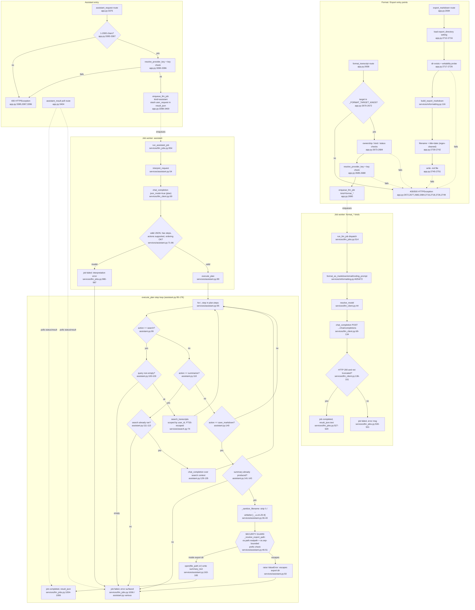

# Feature: reformatting-export-assistant

## Sources consulted
- `app.py:2649-2751` (format_transcript, export_markdown routes), `3373-3421` (assistant_request, assistant_result routes)
- `services/reformatting.py` full file (1-161)
- `services/assistant.py` full file (1-180)
- `services/llm_client.py` full file (1-153)
- `services/llm_jobs.py:400-560` (job dispatch), `930-1007` (assistant dispatch, run_assistant_job)
- `services/search.py:1-146` (search_transcripts, FTS5 sanitization)
- `services/settings.py:52` (export_directory default)

## Concrete findings
**Format/export path**: `format_transcript` (app.py:2658) validates target against `_FORMAT_TARGET_KINDS` (2651-2655), checks ownership/kind/status (2673-2684), resolves provider key (2685-2688), enqueues job kind format_markdown|format_email|format_coding_prompt (2690). Worker (llm_jobs.py:514-531) dispatches to format_as_markdown/email/coding_prompt (reformatting.py:40/54/72), each calls shared `_generate` helper (17-37) -> `resolve_model` (llm_client.py:44) -> `chat_completion` (llm_client.py:69), single non-streaming HTTP POST. Truncation (finish_reason=='length') raises; HTTP non-200 raises; both caught at llm_jobs.py:530, job set failed.

`export_markdown` (app.py:2694) is the no-LLM sibling: reads export_directory from settings (2712-2716), existence+writability probe via temp file write/delete (2717-2726), calls `build_export_markdown` (reformatting.py:116, pure string assembly), builds filename from transcript title+date (2739-2742, sanitized only via fixed regex stripping `\/:*?"<>|`, title from transcript itself not LLM), writes with `open(...,"w")` (2745-2751).

**Assistant path**: `assistant_request` (app.py:3375) validates length (<=2000 chars), resolves provider key, enqueues job kind assistant, stashes raw user_request string in job.result_json (3398-3400) — interpretation/execution happens later in the worker, not inline. `run_assistant_job` (llm_jobs.py:954) calls `interpret_request` (assistant.py:54), sends user text + fixed system prompt to chat_completion in JSON mode, validates returned plan: must parse as JSON, must have "steps" key, every action must be in `_SUPPORTED_ACTIONS = ("search","summarize","save_markdown")` (78), ordering enforced (summarize/save_markdown must follow a search, 81-85). Violation returns {"error":...} -> failed job (llm_jobs.py:982-987), never proceeds to execute_plan.

If plan validates, `execute_plan` (assistant.py:89) walks plan["steps"], dispatching by action:
- search -> `search_transcripts(db,user_id,query)` (search.py:74), read-only, scoped by Transcript.user_id, FTS5 terms double-quoted/escaped (_quote_fts5_term, 20-23) — no raw string concat, safe.
- summarize -> builds context from prior search's matched segments, calls chat_completion again (131-135). No filesystem effect.
- save_markdown -> the only filesystem-writing action, gated by sanitization below.

## Security check: `_sanitize_filename` + `_resolve_export_path` (assistant.py:36-51)
```python
_FILENAME_SAFE_RE = re.compile(r"[^-_.a-zA-Z0-9]")
def _sanitize_filename(filename):
    safe = filename or "summary"
    safe = safe.replace("\\", "-").replace("/", "-").replace("..", "-")
    safe = _FILENAME_SAFE_RE.sub("-", safe)
    safe = safe.strip("-")
    return safe or "summary"

def _resolve_export_path(export_directory, filename):
    resolved = os.path.realpath(os.path.join(export_directory, filename))
    export_real = os.path.realpath(export_directory)
    if not resolved.startswith(export_real + os.sep) and resolved != export_real:
        raise ValueError("Filename escapes export directory")
    return resolved
```
**Verdict: sound, no traversal gap found.** Two independent layers, either alone would block traversal: (1) `_FILENAME_SAFE_RE.sub` is a whitelist ([-_.a-zA-Z0-9] allowed, everything else -> "-"), applied last — structurally excludes path separators regardless of earlier .replace() calls. (2) Even the earlier `.replace("..", "-")` handles all non-overlapping ".." occurrences in one pass, so bypass strings like "....//" don't survive (".... " -> "--", not a reformed ".."). `_resolve_export_path` uses `os.path.realpath` on both sides plus `os.sep`-bounded prefix check with explicit equals-case — correct pattern avoiding the well-known partial-prefix bug ("/home/user_export".startswith("/home/user_exp")-style false positives on sibling dirs). `export_directory` itself is never plan-controlled (comes only from get_user_settings, server-side per-user), so LLM-controlled surface reduces to exactly one string (filename), rendered separator-free before os.path.join. `.md` extension enforced by code (assistant.py:146-147), so plan can't target arbitrary extension either. No code-execution path in execute_plan — only scoped DB read, LLM call, single open(path,"w") text write; no subprocess/eval/exec/template rendering.
One structural note (not a vulnerability): prompt-injection in transcript content returned by search could only influence summarize's output text, not save_markdown's filename — filename is fixed in the plan before search ever runs.

## Side effects
- File writes: export_markdown route (app.py:2745-2751, path from transcript title, sanitized against Windows-reserved chars, not LLM-controlled); execute_plan's save_markdown step (sandboxed write inside export_directory, assistant.py:163-165).
- LLM calls: one per format_as_*/classify_intent call, one for interpret_request (plan generation), one for summarize inside execute_plan — all through chat_completion (llm_client.py:69).
- DB writes: job.progress_done/result_json/status commits throughout llm_jobs.py.

## Error/fallback branches
- classify_intent never raises, falls back to "none" (reformatting.py:108-113) — a UI hint, not reachable via the three traced entry points (sibling auto-classifier).
- format_as_* failures (bad key, HTTP error, truncation) -> job failed (llm_jobs.py:530-531).
- export_markdown: missing/non-existent/non-writable export dir -> HTTP 400/500 before any LLM/plan logic.
- interpret_request: LLM RuntimeError, invalid JSON, missing steps, unsupported action, bad step ordering -> {"error":...}, never reaches execute_plan.
- execute_plan: empty search query, no results, summarize-before-search, save-before-summarize, os.makedirs failure, _resolve_export_path ValueError, file-write OSError all short-circuit with distinct {"ok":bool,"error":...} shapes.

## Mermaid flowchart



## External dependencies
- httpx.AsyncClient — outbound LLM provider HTTP calls (llm_client.py:7,129)
- LLM provider HTTP APIs: Groq, OpenAI, OpenRouter, local OpenAI-compatible server (llm_client.py:9-25)
- SQLite FTS5 virtual table transcripts_fts via SQLAlchemy text() (search.py:11,13,50-64,98-104)
- Filesystem via os/open() (app.py:2717-2751, assistant.py:153-165)
- re/json stdlib for filename sanitization and plan parsing

## Confidence and gaps
High confidence — full text of every core file read, sanitization logic hand-traced against known bypass patterns rather than assumed safe. Did not read enqueue_llm_job's implementation (just call sites) or frontend code calling these endpoints (backend-only scope). Did not verify job.result_json's user_request field protection between enqueue and worker pickup (assumed same-process DB round-trip). classify_intent noted as adjacent, not force-fit into the two traced paths since not reachable from the three named entry points.
