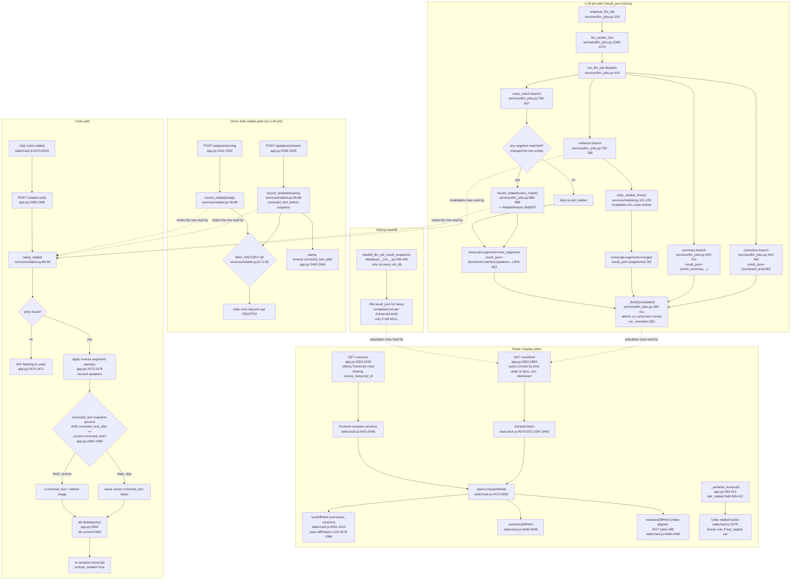

# Feature: run-history-versions

## Sources consulted
- `app.py`: 2348-2409 (speakers/rename), 2411-2452 (segments/retag), 2455-2496 (relabel-undo), 2852-2883 (/runs/{kind}), 3203-3233 (/versions), 354-413 (_serialize_transcript, last_relabel field)
- `services/relabel.py` full file (1-110)
- `database/__init__.py`: 104-124 (LlmJob), 126-137 (RelabelHistory), 406-445 (backfill_llm_job_result_snapshots)
- `services/llm_jobs.py`: 1-52, 109, 350, 383-411, 414-482, 732-768 (rediarize), 769-937 (voice_match), 1009-1070
- `static/rack.js`: 4374-4466 (diff helpers), 4468-4500 (openCompareModal), 5075 (Undo relabel button), 5367-5436 (history click handlers)

## Concrete findings
**Two distinct, only-partly-overlapping history systems**, both under the "run history/versions" umbrella:
1. **LlmJob.result_json history** — one row per background job (correction/summary/rediarize/voice_match/format_*), queried by GET /runs/{kind} (app.py:2852), no cap, includes dismissed jobs. Populated by run_llm_job at completion, per kind, right before `_finish()`.
2. **RelabelHistory inverse-patch stack** — bulk-relabel undo only (rename/retag/voice_match), capped at MAX_HISTORY=20 (relabel.py:8). Queried only via `latest_relabel` for POST /relabel-undo. Not exposed as a list anywhere — only "the newest entry" is ever read.
3. Third, unrelated mechanism: **GET /versions** (app.py:3203) diffs sibling Transcript rows sharing source_transcript_id (retranscribe reruns) — doesn't touch LlmJob or RelabelHistory at all.

**Who calls record_relabel**: NOT run_llm_job generically — only the voice_match branch (llm_jobs.py:886-888). rename (app.py:2382) and retag (app.py:2440) call it directly from synchronous HTTP handlers, bypassing the LLM job queue entirely. So voice_match is the ONLY kind writing to both history systems (LlmJob.result_json snapshot for /runs/voice_match AND a RelabelHistory entry for /relabel-undo) — rename/retag write only RelabelHistory (no LlmJob), correction/summary/rediarize write only result_json (no RelabelHistory, except rediarize which actively clears it).

**Word-level diff**: diffTokens (rack.js:4378) plain LCS diff over token arrays; textDiffHtml (4401) tokenizes on whitespace, falls back to line-level above a 4,000,000-cell product guard. Used for correction-vs-correction, summary's short_summary field, /versions full-text compares. rediarizeDiffHtml (4446) is separate, non-LCS, index-aligned segment compare — segment count mismatches called out rather than misaligned.

**Error/fallback branches confirmed**:
- No relabel history to undo -> latest_relabel returns None -> 404 "Nothing to undo" (app.py:2470-2471).
- Undo staleness guard: before-image for corrected_text restored only if corrected_text still equals stamped corrected_text_after (2482-2490) — a correction re-run between rename and undo silently skips that part of revert rather than clobbering newer LLM output.
- Rediarize wholesale regeneration invalidates every RelabelHistory entry via clear_relabel_history (llm_jobs.py:759) since inverse patches are index-based against old segmentation.
- History cap: record_relabel deletes stale rows beyond MAX_HISTORY=20 per transcript, relying on SQLAlchemy autoflush counting the just-added row (relabel.py:71-85).
- /runs/{kind} and compare modal: a run whose result is null (predates history tracking, or job never completed) renders "no snapshot"/"predate history tracking" text instead of diffing.
- Backfill: backfill_llm_job_result_snapshots (database/__init__.py:406) fills result_json for pre-existing completed jobs from current transcript/summary state on every startup, no-op once done; explicitly does NOT backfill superseded (non-latest) jobs — those stay snapshot-less permanently.
- Concurrent runs: _finish/_transition make a cancel racing a completion atomic — a cancelled job's result_json write does not survive, _finish returns False and caller's pending writes get rolled back.

## Mermaid flowchart

## External dependencies
record_relabel: 3 call sites total, 2 bypass the LLM job queue entirely — app.py:2382 (rename, direct HTTP handler), app.py:2440 (retag, direct HTTP handler), services/llm_jobs.py:886-888 (voice_match branch of run_llm_job, the ONLY kind where LLM-job-queue path and RelabelHistory-undo path intersect). clear_relabel_history: one call site, services/llm_jobs.py:759 (rediarize branch).

## Confidence and gaps
High confidence, all traced call chains read directly. Did not trace enqueue_llm_job's callers (what UI actions kick off correction/summary/rediarize/voice_match) — out of scope, starts at job-completion. Did not verify format_*/classify_intent/voice_note/voice_dump branches of run_llm_job in equal depth — confirmed they also set result_json (grep hits 527,539,581,621,681,727) and readable via /runs/{kind}, but no compare-modal call site found for those kinds in rack.js — their history may be write-only from UI's perspective beyond export.
