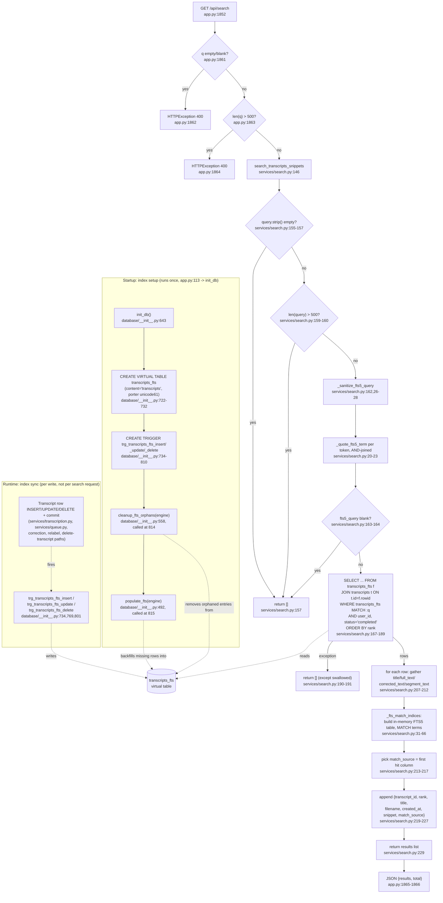

# Feature: search

## Sources consulted
- `app.py:1852-1866` (/api/search), `684-699` (_build_recent_transcripts), `108-113` (init_db call site)
- `services/search.py` full file (1-229)
- `database/__init__.py:492-641` (populate_fts, cleanup_fts_orphans), `643-835` (init_db incl. FTS DDL/triggers 704-810)
- `services/assistant.py:11,104` (second consumer of search_transcripts)
- Grep of `Transcript(` writes across repo

## Concrete findings
- Query path: `app.py:1852` validates q non-empty (1861-1862) and <=500 chars (1863-1864) -> `services/search.py:146 search_transcripts_snippets`. That function re-validates (155-160, dead code given app.py's gate) -> `_sanitize_fts5_query` (26-28) -> `_quote_fts5_term` per token, AND-joined (20-23) -> single SQL: `transcripts_fts MATCH :q` joined to transcripts, filtered by user_id/status='completed', ordered by rank, `snippet()` for highlights (167-189). Exception (malformed FTS5 syntax) swallowed -> `[]` (190-191). Per row, `_fts_match_indices` (31-66) builds a throwaway in-memory FTS5 table to attribute which column matched (porter-stemmed match attribution, issue #192) -> match_source (207-217).
- `search_transcripts` (74-143, used by /api/transcripts?q= and services/assistant.py:104) shares sanitize/MATCH pattern but raises ValueError on overlong query instead of swallowing, returns per-segment matches not snippets.
- **Index maintenance is NOT per-write Python calls.** `app.py:113` calls `init_db()` once at startup. Inside: `transcripts_fts` virtual table created (722-732, external-content mode, porter unicode61), then three SQL triggers (insert 734-742, update 769-782 unconditionally DROP+CREATE to fix stale bodies from #206/#309, delete 801-810) fire automatically on any ORM insert/update/delete against `transcripts` — this is what keeps the index in sync, decoupled from any feature's Python code. `cleanup_fts_orphans` (558-640, runs first) then `populate_fts` (492-552, runs second) are one-time startup backfill/repair jobs, not per-write hooks. Both idempotent no-ops once caught up.
- Non-test call sites that create/mutate Transcript rows (thus fire triggers): `services/transcription.py`, `services/queue.py`, plus correction/relabel/diarization update paths via ORM commits.

## Mermaid flowchart

## External dependencies
- Only `database/__init__.py:init_db()` calls `populate_fts`/`cleanup_fts_orphans`, called once from app.py:113 at process startup — no request-time or per-write code path calls either directly.
- Real sync mechanism: the three SQL triggers, fired by SQLite itself on any write to `transcripts`, regardless of which feature performed it.
- Other consumers: `services/assistant.py:104` (search_transcripts for AI assistant lookup), `app.py:684-699 _build_recent_transcripts` (search_transcripts for /api/transcripts?q=).

## Confidence and gaps
High confidence, all line numbers verified against source. Did not trace into services/transcription.py or services/queue.py for the exact db.commit() line that fires triggers — grep-confirmed as non-test Transcript-mutating files, sufficient to identify trigger callers but not line-exact for that specific commit. Did not deep-read tests/test_search.py.
