# Feature: storage-db-layer

## Sources consulted
- `database/__init__.py` full file, lines 1-843
- `app.py:100-149` (init_db call site + post-init_db migration follow-up), grep for backfill_user_id/migrated_tables/init_db( call sites

## Concrete findings
- Entry: `init_db(db_path="data/whisperdesk.db")` at line 643, returns `(engine, SessionLocal, migrated_tables)`.
- 13 ORM models, lines 17-286: User, Transcript, TranscriptionJob, LlmJob, RelabelHistory, HotwordEntry, Summary, VoiceNote, VoiceDumpItem, TranscriptTag, VoiceProfile, VoiceClip, ProviderConfig.
- **Migration mechanism, three escalating techniques**:
  1. Additive columns: `ensure_columns` (337) via SQLAlchemy `inspect(engine).get_columns()` diff -> bare `ALTER TABLE ADD COLUMN` per missing column inside `engine.begin()`. Restricted to nullable/unconstrained columns. No-op if table doesn't exist yet.
  2. Constraint change needing redefinition: `ensure_nullable_llm_job_transcript_id` (358). Reads raw `PRAGMA table_info(llm_jobs)` for notnull flag; if already nullable, no-op. Else RENAME->CREATE(new schema)->INSERT SELECT->DROP, one `engine.begin()`.
  3. Table-level rescoping (adding required FK-like column e.g. user_id): `migrate_schema` (288) + `backfill_user_id` (318), split across the create_all() boundary. migrate_schema renames tables lacking user_id to `_old`; create_all() recreates fresh; backfill_user_id copies rows back with a supplied user_id then drops `_old` — **called from OUTSIDE init_db**, only by app.py (see gap below).
- **Idempotency verdict: yes**, every step checks current state and short-circuits to no-op if already applied. Two one-time backfills (voice_dump_items.seen_at, classification_provenance) guard via an "was absent right before ensure_columns" flag captured same call. populate_fts/cleanup_fts_orphans also idempotent (anti-join / docsize-membership checks).
- **Fresh DB**: migrate_schema finds no existing_tables match -> returns [] immediately; create_all() builds full current schema in one shot; every ensure_columns sees columns already present, adds nothing; classification_columns_were_absent explicitly returns False on fresh DB.
- **Existing DB missing columns**: ensure_columns adds exactly the missing ones; migrate_schema renames+rebuilds only the 3 pre-user-scoping tables lacking user_id.
- **Transaction wrapping**: each helper function's own statements run inside `engine.begin()` (atomic per function), but **no top-level transaction spans multiple steps of init_db** — each ensure_columns/migration call is independent. Failure mid-startup: exception propagates uncaught to app.py:113, app fails to start; already-committed prior steps stay committed; safe to resume next restart since every step re-checks state first. Final admin-promotion (820-833) uses plain SessionLocal()+commit()/finally:close(), single conditional row write, same idempotency applies.
- **Notable gap/seam**: `backfill_user_id` is never called inside database/__init__.py — it's the caller's job. Only app.py:141 does it (gated on `if migrated_tables:`, using a fallback "local" user). scripts/reset_password.py and tests call init_db directly and discard migrated_tables — would leave `*_old` tables undropped/unmigrated if that path ever triggered for them.

## Mermaid flowchart

```mermaid
flowchart TD
    A["init_db()<br/>database/__init__.py:643"] --> B["create_engine(sqlite:///db_path)<br/>database/__init__.py:654"]
    B --> C["register _set_sqlite_pragmas<br/>on 'connect' event<br/>database/__init__.py:661"]
    C --> D["migrate_schema(engine)<br/>database/__init__.py:288"]
    D --> D1{"provider_configs / transcripts /<br/>voice_profiles missing user_id?"}
    D1 -->|yes| D2["ALTER TABLE X RENAME TO X_old<br/>database/__init__.py:313"]
    D1 -->|no| E
    D2 --> E["Base.metadata.create_all(engine)<br/>database/__init__.py:675"]
    E --> F["classification_columns_were_absent(engine)<br/>database/__init__.py:448"]
    F --> G["ensure_columns(users, settings)<br/>database/__init__.py:680"]
    G --> H["ensure_columns(transcripts, {16 cols})<br/>database/__init__.py:681"]
    H --> I["ensure_columns(llm_jobs, {dismissed,result_json,attempts})<br/>database/__init__.py:682"]
    I --> J["ensure_nullable_llm_job_transcript_id(engine)<br/>database/__init__.py:358"]
    J --> J1{"transcript_id already nullable?<br/>PRAGMA table_info check"}
    J1 -->|no| J2["RENAME→recreate→copy→DROP<br/>llm_jobs_old<br/>database/__init__.py:379-403"]
    J1 -->|yes| K
    J2 --> K["ensure_columns(summaries, provider)<br/>database/__init__.py:684"]
    K --> L["ensure_columns(users, is_admin/reset_token/*)<br/>database/__init__.py:685"]
    L --> M["ensure_columns(users, local_device_token_*)<br/>database/__init__.py:686"]
    M --> N["ensure_columns(voice_clips, embedding_model)<br/>database/__init__.py:687"]
    N --> O["capture _vd_seen_at_was_absent<br/>database/__init__.py:690"]
    O --> P["ensure_columns(voice_dump_items, seen_at)<br/>database/__init__.py:694"]
    P --> P1{"seen_at was absent?"}
    P1 -->|yes| P2["UPDATE voice_dump_items<br/>SET seen_at = now()<br/>database/__init__.py:698"]
    P1 -->|no| Q
    P2 --> Q["CREATE TABLE IF NOT EXISTS transcript_tags<br/>+ CREATE INDEX ix_transcript_tags_tag<br/>database/__init__.py:705"]
    Q --> R["CREATE VIRTUAL TABLE IF NOT EXISTS<br/>transcripts_fts (fts5)<br/>database/__init__.py:722"]
    R --> S["CREATE TRIGGER IF NOT EXISTS<br/>trg_transcripts_fts_insert<br/>database/__init__.py:734"]
    S --> T["DROP TRIGGER IF EXISTS + CREATE<br/>trg_transcripts_fts_update (unconditional)<br/>database/__init__.py:769"]
    T --> U["CREATE TRIGGER IF NOT EXISTS<br/>trg_transcripts_fts_delete<br/>database/__init__.py:801"]
    U --> V["cleanup_fts_orphans(engine)<br/>database/__init__.py:558"]
    V --> V1{"orphaned fts rows exist?"}
    V1 -->|yes| V2["delete-all + chunked reinsert<br/>from live transcripts<br/>database/__init__.py:619-638"]
    V1 -->|no| W
    V2 --> W["populate_fts(engine)<br/>database/__init__.py:492"]
    W --> W1["backfill segment_text +<br/>insert missing fts rows<br/>database/__init__.py:526-552"]
    W1 --> X["SessionLocal = sessionmaker(bind=engine)<br/>database/__init__.py:816"]
    X --> Y["backfill_llm_job_result_snapshots(SessionLocal)<br/>database/__init__.py:406"]
    Y --> Z["backfill_legacy_classification(SessionLocal, was_absent)<br/>database/__init__.py:463"]
    Z --> AA{"was_absent (captured at step F)?"}
    AA -->|yes| AA2["bulk UPDATE transcripts<br/>classification_status='override'<br/>database/__init__.py:479-485"]
    AA -->|no| AB
    AA2 --> AB["first-user-is-admin promotion<br/>database/__init__.py:822-833"]
    AB --> AC["return (engine, SessionLocal, migrated_tables)<br/>database/__init__.py:835"]
    AC -.->|"caller: app.py:113"| EXT["app.py: if migrated_tables:<br/>get_or_create_fallback_user +<br/>backfill_user_id(engine, migrated_tables, uid)<br/>app.py:137-147 -> database/__init__.py:318"]
```

Node D2 and J2 each run inside their own `engine.begin()` (atomic per-step, not spanning the whole init_db call). Dashed edge to EXT marks backfill_user_id is NOT invoked inside init_db — caller's job, currently done only by app.py.

## Model list
- User (`users`, 17) — accounts/auth/settings/admin flag/device pairing. Owner: auth-accounts.
- Transcript (`transcripts`, 33) — core transcription record, hub table most features hang off. Owner: transcription-pipeline.
- TranscriptionJob (`transcription_jobs`, 85) — per-chunk work item. Owner: chunked-queue.
- LlmJob (`llm_jobs`, 104) — background LLM work, drives Queue screen. Owner: llm-job-queue.
- RelabelHistory (`relabel_history`, 126) — undo log for speaker relabel. Owner: run-history-versions.
- HotwordEntry (`hotword_entries`, 140) — user vocabulary terms. Owner: correction-hotwords.
- Summary (`summaries`, 150) — summary/key-points/action-items per transcript. Owner: reformatting-export-assistant.
- VoiceNote (`voice_notes`, 166) — structured voice-note capture output. Owner: voice-notes-dump.
- VoiceDumpItem (`voice_dump_items`, 193) — one item from multi-item voice-dump. Owner: voice-notes-dump.
- TranscriptTag (`transcript_tags`, 220) — LLM-derived tags. Owner: classification-tagging.
- VoiceProfile (`voice_profiles`, 243) — enrolled speaker voice-print. Owner: voice-id-match.
- VoiceClip (`voice_clips`, 258) — individual clip backing a VoiceProfile. Owner: voice-id-match.
- ProviderConfig (`provider_configs`, 273) — per-user provider credentials/defaults. Owner: providers-settings-cost.

## Confidence and gaps
High confidence, full file read in one pass, call order verified line-by-line against actual code (several prompt-given lines were approximate but close). Did not execute code/test suite. Did not exhaustively enumerate every init_db caller beyond app.py, scripts/reset_password.py, and one test file — other scripts calling init_db and discarding migrated_tables could leave `_old` tables stranded. Did not verify SQLite-version-dependent ALTER TABLE behavior beyond what code comments assert.
