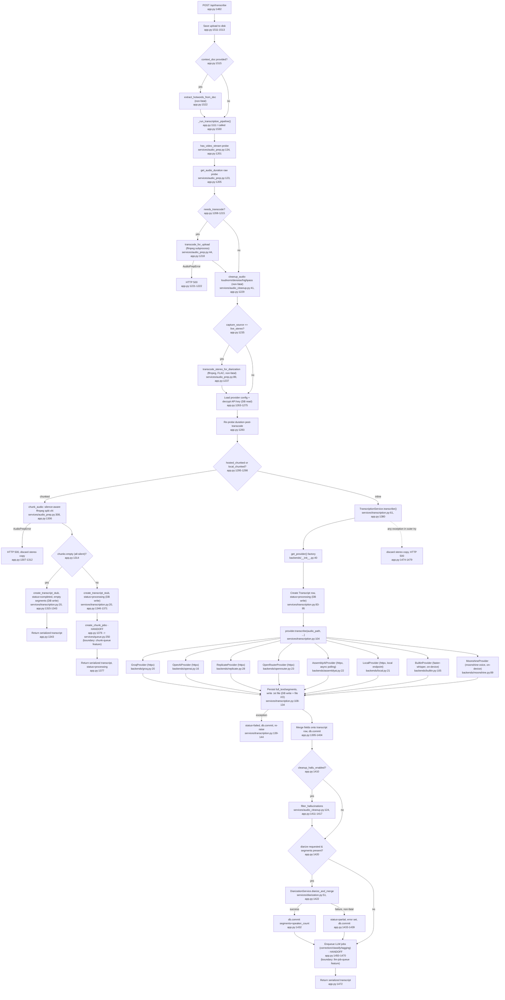

# Feature: transcription-pipeline

## Sources consulted
- `app.py:1111-1480` (`_run_transcription_pipeline`), `1482-1543` (POST /api/transcribe route), `32-69` (imports), `149-150` (service instantiation)
- `backends/__init__.py` (full — get_provider, PROVIDER_REGISTRY, LOCAL_PROVIDERS)
- `backends/base.py` (full — BaseProvider, Segment, TranscriptionResult)
- `services/transcription.py` (full — TranscriptionService.create_transcript_stub, .transcribe)
- `services/audio_prep.py` (full — transcode_for_upload, transcode_stereo_for_diarization, get_audio_duration, has_video_stream, extract_clips_concat, chunk_audio, is_silent_audio, detect_silence_midpoints)
- `backends/moonshine.py:1-30`
- Grep-confirmed `async def transcribe` line numbers across all 8 backend files

## Concrete findings
- `app.py:1482 transcribe_audio()` → save upload (1511) → optional non-fatal hotword extraction from context_doc (1515-1528) → `_run_transcription_pipeline()` (1111, called 1530).
- Pipeline: video detect (audio_prep.py:134) → duration probe (audio_prep.py:123) → transcode decision → `transcode_for_upload` ffmpeg (audio_prep.py:44, HTTP 500 on AudioPrepError) → non-fatal `cleanup_audio` (audio_cleanup.py:41) → optional stereo FLAC copy for diarization (audio_prep.py:89, non-fatal) → provider config load + API-key decrypt (DB read, 1263-1275) → re-probe duration (1283).
- Branch at app.py:1295-1298 `hosted_chunked or local_chunked`:
  - **Chunked**: `chunk_audio` silence-aware ffmpeg split (audio_prep.py:308) → empty-chunks special case (all-silent) creates completed stub with empty segments, early return → else `create_transcript_stub` (status=processing, DB write) → **HANDOFF** `create_chunk_jobs` (app.py:1376 → services/queue.py:250, chunk-queue feature boundary) → return.
  - **Inline**: `TranscriptionService.transcribe` (transcription.py:61) → `get_provider()` factory → create Transcript row (status=processing) → `provider.transcribe(...)` dispatches to one of: groq/openai/replicate/openrouter/assemblyai/local (all httpx external) or builtin/moonshine (on-device, no network) → persist full_text/segments + write .txt file → commit; exception path sets status=failed, re-raises.
- Both branches converge: merge fields/commit (1395-1404) → optional `filter_hallucinations` (audio_cleanup.py:124) → optional `DiarizationService.diarize_and_merge` (diarization.py:51), failure is non-fatal (status=partial) → **HANDOFF** enqueue correction/classify/tagging LlmJobs (1450-1470, llm-job-queue feature boundary) → return serialized transcript.
- Top-level `except Exception` (1474-1479): discards orphaned stereo FLAC, HTTP 500.
- `/api/bulk-transcribe` reuses this same `_run_transcription_pipeline` per file — thin fan-out wrapper, not a divergent pipeline (relevant to batch-bulk-files feature).

## Mermaid flowchart

## External dependencies
- **chunk-queue handoff**: app.py:1376 -> services/queue.py:250 `create_chunk_jobs`. Downstream chunk processing is a separate feature.
- **llm-job-queue handoff**: app.py:1450-1470 enqueues enqueue_auto_correction/enqueue_pipeline_classify/enqueue_auto_classify/enqueue_auto_voice_note/enqueue_auto_voice_dump/enqueue_auto_tagging in services/llm_jobs.py.
- ffmpeg subprocess via `services/audio_prep.py` (`_ffmpeg_bin()`/`_ffprobe_bin()` at 25-34).
- External HTTP APIs: Groq, OpenAI, Replicate, OpenRouter, AssemblyAI, user-configured Local endpoint (httpx.AsyncClient).
- On-device ML: builtin.py (faster-whisper), moonshine.py (moonshine-voice), no network.
- DB writes: ProviderConfig read, Transcript row create/update both branches.
- File I/O: uploaded file, transcoded mp3/FLAC/chunk files under UPLOAD_DIR, plaintext .txt under transcripts/.

## Confidence and gaps
High confidence, all cited lines read directly. Not traced: services/queue.py internals beyond create_chunk_jobs signature (separate feature), services/llm_jobs.py internals for the enqueue calls (separate feature). diarization.py and audio_cleanup.py aren't in the original core-files list but are inline dependencies, included with verified line numbers. /api/bulk-transcribe intentionally left out of the diagram (thin per-file wrapper around this same pipeline, not divergent) — noted for cross-reference with batch-bulk-files feature.
