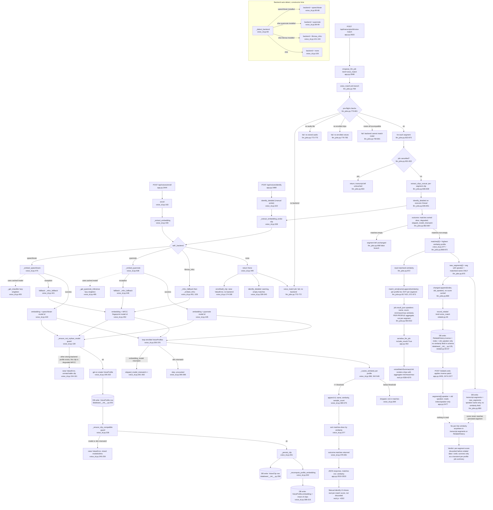

# Feature: voice-id-match

## Sources consulted
- `services/voice_id.py` full file (1-551)
- `services/llm_jobs.py` lines 1-55, 760-938 (voice_match job branch)
- `services/relabel.py` full file (1-110)
- `database/__init__.py` 126-138 (RelabelHistory), 243-271 (VoiceProfile, VoiceClip)
- `app.py` 3438-3574 (/api/voices/* routes), 2823-2850 (/voice-match route), 2455-2494 (/relabel-undo), 321,399-402 (job serialization)
- `static/rack.js` 4300-4370 (voiceMatchSummaryUnit, similarityPct)

## Concrete findings
**Backend cascade** (voice_id.py:83-106, _detect_backend): speechbrain (85-86) -> pyannote (89-99) -> librosa (101-104) -> "none" (106). Runtime per-call fallback is separate: `_extract_embedding` (430-449) tries detected primary backend, on any exception in `_embed_speechbrain`(475-493) or `_embed_pyannote`(508-526) calls `_mfcc_fallback` -> `_embed_mfcc` (451-453,528-540). A degraded MFCC clip against an existing strong-backend profile is refused by `_ensure_not_orphan_model` (139-161).

**Enroll** (163-207): _extract_embedding -> _ensure_not_orphan_model guard -> get-or-create VoiceProfile (190-202, DB write) -> _ensure_clip_compatible guard (238-259) -> _persist_clip (261-280): creates VoiceClip row (DB write) then _recompute_profile_embedding (302-315), means all clip embeddings, writes VoiceProfile.embedding/sample_count (DB write).

**Manual identify** (identify_detailed, 322-381, hit from POST /api/voices/identify app.py:3489-3520): for each enrolled profile, skip on embedding_model mismatch (361-363) or dim mismatch (365-366), else `_cosine_similarity` (368,542-548). If similarity >= threshold, append {id,name,similarity,sample_count} (369-375); sorted descending (377). This full per-profile similarity list returns in JSON (app.py:3510-3520), rendered in manual-identify UI — **this path is NOT discarded**, genuine one-off consumer of per-match scores.

**Voice-match batch job** — the path PR #311 touched (POST /transcripts/{id}/voice-match app.py:2823-2849 -> enqueue_llm_job(kind="voice_match") -> llm_jobs.py:769-937):
- Pre-flight: backend none (770-772), no audio (773-775), no enrolled clips (776-783), roster entirely incompatible (794-801).
- Per segment (823-875): extract clip (extract_clips_concat, 836-839), run identify_detailed off-thread (846-851), read outcome["matches"] (863).
- **If matches non-empty (868-873)**: `changed.append((i, seg.get("speaker") or ""))` — **only segment index and old speaker string, no score** (869). `new_segments[i] = {**seg, "speaker": matches[0]["name"]}` — **only the winning profile's name written; matches[0]["similarity"] read on the very next line but never attached to the segment** (870-873). `match_sims.setdefault(matches[0]["name"], []).append(float(matches[0]["similarity"]))` diverts similarity into a **per-profile-name list**, not per-segment (817-821,871-873).
- After loop: `record_relabel(db, transcript, "voice_match", changed, ...)` (886-888) writes RelabelHistory.inverse = {"segments":[{"index":i,"speaker":old}],...} — **no similarity field exists in this schema or call**.
- `transcript.segments = new_segments` (890) is the persisted, relabel-consuming data — carries new speaker name and nothing about confidence.
- `job.result_json["speakers"]` (903-921) aggregates match_sims into min/mean/max similarity **per matched profile name (not per segment)**, returned via serialize_llm_job to frontend and rendered as chips in voiceMatchSummaryUnit (rack.js:4338-4370) — the actual PR #311 deliverable, a coarse job-scoped per-profile summary.

**Undo confirms the discard**: POST /relabel-undo (app.py:2455-2494) reads entry.inverse.get("segments",[]) and only has index/speaker to work with — no similarity value anywhere in the record to read even if it wanted to.

### Verdict on the discarded-score claim: **CONFIRMED, precisely**
The per-segment cosine similarity (voice_id.py:368) is used twice on its way out of identify_detailed — as a threshold gate (369) and sort key picking matches[0] (377) — so it does influence which speaker gets written. But once llm_jobs.py:870 builds the new segment, only matches[0]["name"] survives; the float is read once more (872) purely to feed a profile-name-keyed aggregate (match_sims -> job.result_json["speakers"]). That aggregate reaches the UI once as a summary chip, but:
- Never attached to the individual segment (transcript.segments[i] has no similarity/confidence key).
- Never captured by record_relabel (changed tuples carry only index + old speaker), so RelabelHistory.inverse has nothing to show.

The per-segment score is discarded before it reaches the transcript's segment data and before it reaches the relabel-history/undo record — it survives only as a transient, coarser, per-profile min/mean/max summary tied to that one job's result_json, overwritten the next time voice-match reruns on that transcript.

## Mermaid flowchart

## External dependencies
Backend libraries: speechbrain EncoderClassifier, torchaudio, pyannote.audio Model/Inference, torch, soundfile, librosa MFCC, numpy. DB: VoiceProfile, VoiceClip, RelabelHistory (SQLAlchemy).

## Confidence and gaps
High confidence on discard verdict — traced by exact line for both "used" path (threshold gate, sort, job-summary aggregate, UI chip) and "discarded" path (segment write, RelabelHistory.inverse schema, undo apply). Not independently verified: exact rendering trigger for voiceMatchSummaryUnit in the DOM polling code; whether any test asserts the per-segment-discard behavior explicitly (test file exists, not opened). services/diarization.py and extract_clips_concat not read beyond name/call-site confirmation, out of this feature's scope.
