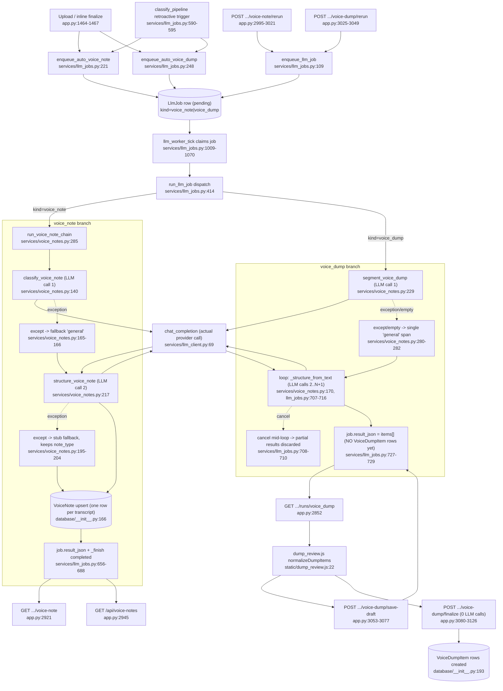

# Feature: voice-notes-dump

## Sources consulted
- `services/voice_notes.py` full file (1-306)
- `services/llm_jobs.py` full file (1-1081)
- `app.py:1420-1472` (upload/finalize trigger), `2610-2884` (/runs/{kind}), `2886-3200` (voice-note/voice-dump routes)
- `database/__init__.py:150-239` (Summary, VoiceNote, VoiceDumpItem, TranscriptTag)
- `static/dump_review.js` full file (1-80)
- `services/llm_client.py:44,69` (resolve_model, chat_completion signatures)

## Concrete findings
- **The chain**: `run_voice_note_chain` (voice_notes.py:285-305) is a strict two-call sequence: `classify_voice_note` (140) then `structure_voice_note` (217 -> `_structure_from_text` at 170). `segment_voice_dump` (229) is a SEPARATE sibling function, NOT called by run_voice_note_chain — invoked directly from the job runner's voice_dump branch.
- **Invocation sites**: `enqueue_auto_voice_note` (221) / `enqueue_auto_voice_dump` (248) called from two places: upload/inline-finalize (app.py:1464-1467) and a retroactive trigger inside classify_pipeline job branch (llm_jobs.py:590-595, fires once an auto-kind transcript's classification resolves). Manual reruns bypass the enqueue_auto_* gates and call enqueue_llm_job directly (app.py:3021 voice-note/rerun, app.py:3049 voice-dump/rerun). All converge on one LlmJob row -> llm_worker_tick (1009) -> run_llm_job (414), dispatch by job.kind.
- **LLM call count — correction to task framing**: POST voice-dump/finalize (app.py:3080-3126) makes **ZERO** LLM calls — only reads client-submitted (already reviewed) item list, filters discarded items, inserts VoiceDumpItem rows. All LLM work happens earlier/async inside the voice_dump LlmJob (llm_jobs.py:691-731; comment at 695 explicitly: "VoiceDumpItem rows are NOT created here, that is #285, called by the finalization endpoint").
- For that job, actual LLM call count is **1 + N** (dynamic): one `segment_voice_dump` call to split transcript into spans, then one `_structure_from_text` call per resulting segment (llm_jobs.py:707-716 loop). N determined by segment_voice_dump's return (minimum 1 via its own fallback).
- For voice_note: fixed **2** LLM calls (classify + structure, llm_jobs.py:636, progress_total=2).
- **Partial-completion/fallback**: classify_voice_note never raises, exception -> fallback "general" (voice_notes.py:165-166). `_structure_from_text` never raises, exception -> stub `{type: note_type, title: first-line, body: raw-text, structured: {}}` (195-204) — type is the passed-in note_type, so **a structure-step failure keeps the classify step's result**. segment_voice_dump never raises, parse error/empty -> single `{"span_text": full_text, "tentative_type": "general"}` fallback (280-282), collapsing a would-be multi-item dump into one.
- Gap found: in voice_dump loop, structured items accumulate in a local list, written to job.result_json only after the ENTIRE loop finishes (727). Cancel mid-loop (checked 709-710) returns immediately and discards every already-completed structure call for that run — no partial result_json persisted; rerun repeats the whole sequence from scratch.

## Mermaid flowchart

## External dependencies
- llm-job-queue: owns enqueue helpers, worker tick/claim loop, _transition/_finish primitives, dispatch table in run_llm_job.
- services/llm_client.py: chat_completion(69)/resolve_model(44) are the actual provider-API boundary; every LLM call in voice_notes.py routes through `_generate` (voice_notes.py:112) wrapping chat_completion.
- static/dump_review.js: pure DOM-free helper (normalizeDumpItems, materializeDumpItems) consumed by the Dump Review tab in rack.js (web-ui-signal-rack territory, not traced further).

## Confidence and gaps
High confidence on call graph, DB writes, fallback semantics — verified by direct reads. Not explored: rack.js DOM/UI wiring around dump_review.js; services/classification.py's effective_kind/classify_pipeline_kind internals (gate deciding when a transcript counts as voice_note/voice_dump). Soft assumption: frontend fetches draft items via GET .../runs/voice_dump inferred from docstring, not confirmed by an explicit rack.js fetch call (out of scope file).
