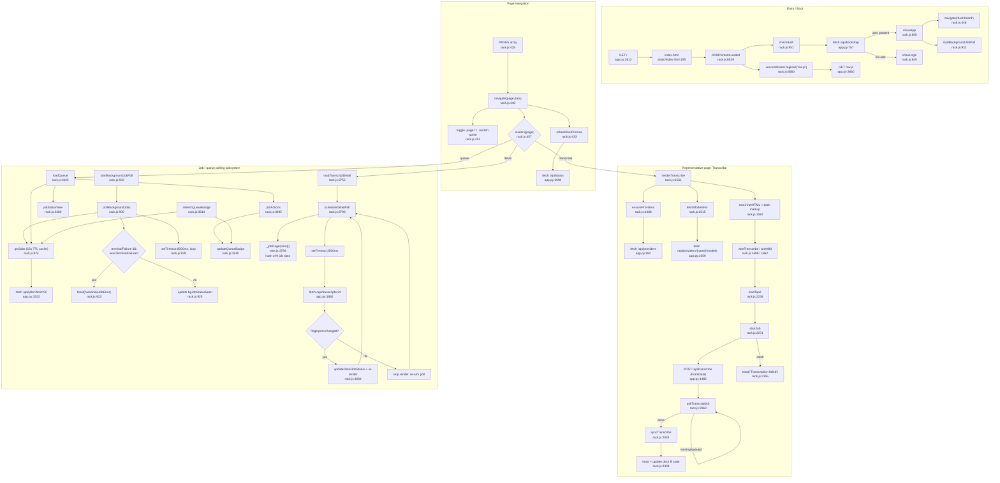

# Feature: web-ui-signal-rack

## Sources consulted
- `static/rack.js`: full-file grep for top-level function/const/class/let definitions (unbounded, no 150-match cap this time), plus targeted reads at 1-142, 243-330, 425-474, 858-967, 896-943, 1561-1630, 2271-2358, 3374-3423, 3610-3622, 3784-3812, 6515-6574
- `static/index.html` full file (157 lines)
- `static/sw.js` full file (80 lines)
- `app.py`: grep of all @app.get/post decorators (full list), reads at 3613-3690

## Phase 0 blind spot corrected: definitions past line 5767
Phase 0's grep capped at 150 matches, missing 5767-6574 entirely. That range contains 4 sections never seen:
- **Voice-roster modals** (~5766-5930): openEnrollModal(5767), openAddClipModal(5820), openIdentifyModal(5859), renderThresholds(5888), runIdentify(5901)
- **Files page** (5931-6026): fmtBytes(5931), renderFilesPage(5938), deleteSelectedFiles(6007)
- **Settings/"Service panel" page** (6027-6526, largest missed block ~500 lines): JACK_DEFS(6027), jackRow(6037), setJackLed(6056), CLEANUP_FIELDS(6080), cleanupFieldRow(6101), loadSettingsPage(6122, biggest function in file), syncFaceplate(6481), renderHotwordRows(6493), addHotword(6515)
- **Boot/init block** (6528-6574): DOMContentLoaded wiring rail nav, auth form, modal/Escape handling, file-input change, video-dock buttons, service-worker registration, checkAuth() call, plus a window test-hook block (6572-6574) exposing navigate/S/syncTranscribe/renderDetail/curProv/logout/api/loadCostsPage/_jobFingerprint/startJob for Playwright.

Phase 0's inventory was missing three whole product surfaces (Files page, Settings/service-panel incl. patch-bay jack rows and hotword list, voice-roster enroll/add-clip/identify modals) plus the entire bootstrap sequence.

## Page navigation happy path
`index.html:155` loads `<script defer src="/static/rack.min.js">`. `app.py:3613 GET /` serves index.html. DOMContentLoaded (rack.js:6529) wires rail buttons, calls `checkAuth()` (951) -> raw fetch('/api/bootstrap') (app.py:757), caches as bootData, sets csrfToken, calls `showApp()` (858) -> `navigate('dashboard')`.

`navigate(page,data)` (446) validates against PAGES (425), sets S.page, toggles .page-*/.rail-btn visibility, dispatches to a per-page loader from the `loaders` map (457-471). Each loader does its own api() fetch(es), re-renders its `#page-<name>` container's innerHTML. No URL hash/routing — pure JS state, not History API.

## Job/queue polling sub-flow
- `startBackgroundJobPoll()` (932), called once from showApp(), runs forever while logged in: clears existing timer, resets bgJobStatusSeen, calls `pollBackgroundJobs()` (900) -> `getJobs()` (874), self-schedules via setTimeout(...,8000) regardless of success/failure (fetch failures silently swallowed, "retry next tick").
- `getJobs(opts)` (874): shared 15s TTL cache (_JOB_CACHE_TTL=15000) with in-flight dedup, wraps `api('/api/jobs?limit=50')`. Every consumer (background poll, loadQueue, refreshQueueBadge) reads this one cache; `{force:true}` bypasses it for a one-shot fresh read.
- `jobStatusView(j)` (3380) maps job status to LED-bargraph color/lit-count/nixie text; `jobActions(j)` (3395) renders action buttons gated by j.kind/j.status.
- `updateQueueBadge(active)` (3610) sets nav rail badge text; `refreshQueueBadge(force)` (3614) best-effort wrapper, swallows errors.
- Terminal-failure toasting: `pollBackgroundJobs` tracks bgJobStatusSeen (job id -> last-seen status) across ticks. A job toasts only when status==='failed' && will_retry===false AND not already marked 'terminalFailed' on a prior tick, AND not the very first tick after login (bgJobPollFirstTick guard so pre-existing failures don't all toast at once).

**Detail-page poll and fingerprint** (3784-3811): `scheduleDetailPoll()` only arms if at least one LLM job on the open transcript is "active" per `llmJobActive()` (correction/summary/voice_match/format_markdown/format_email/format_coding_prompt/classify_intent/tagging/voice_dump). Snapshots `_jobFingerprint(t)` — maps each of 9 job slots to `status:done-count`, joined with `|` — before a 2500ms setTimeout. On fire, re-fetches /api/transcripts/:id, calls `updateDetailJobStatus()` re-render **only if the fresh fingerprint differs from pre-fetch one**. Anti-flicker mechanism: re-renders only when a tracked job's status/progress actually changed; stops re-arming once no job active. Guards (S.page!=='detail', detailData.id!==id) prevent stale timers clobbering state after navigation.

## Side effects
**fetch() to app.py** grouped by page: Boot/auth (/api/bootstrap, /api/csrf-token, /api/login, /api/register, /api/logout, /api/me, /api/forgot-username, /api/forgot-password, /api/reset-password); Dashboard (/api/status, /api/costs partial); Transcribe (/api/providers, /api/providers/{name}/models, POST /api/transcribe, /api/costs/estimate); Transcript library/detail (/api/transcripts, /.../{id}, /api/search, /.../audio, /.../video, /.../speakers/rename, /.../segments/retag, /.../relabel-undo, /.../enroll-speaker, /.../summarize, /.../format/{target}, /.../export-markdown, /.../correct, /.../rediarize, /.../voice-match, /.../context, /.../versions, /.../retry-failed-chunks, /.../cancel, /.../resume, /.../retranscribe); Bulk (/api/bulk-transcribe, /api/batches, /.../{id}, /.../{id}/cancel); Voice notes/dump; Jobs/queue; Assistant; Voice roster; Settings/files/admin; Misc (/api/health, GET /, GET /sw.js).

**localStorage**: rack-theme, rack-motion, rack-phosphor — read once in loadPrefs() (127) on boot, written by applyTheme/applyMotion/applyPhosphor (104-125) on Settings change.

**sessionStorage**: wd_assistant_history (486 read, 699 write) — Assistant page conversation history, tab lifetime only.

**Service worker** (sw.js, served at app.py:3660 with a content-hash CACHE_VERSION fingerprint forcing reinstall on bundle change): a **caching layer, not offline-queue**. Fetch handler (sw.js:60-80): /api/* -> network-first with cache fallback (no queueing, no background sync); everything else -> cache-first falling back to network. Precache: /, rack.min.js, rack.min.css, fonts.

## Error/fallback branches
- `api()` (243): 401 -> forces showLogin(), throws. 403 on mutating request -> one-shot CSRF-token refresh + retry, then re-checks 401. Other non-ok -> throws Error(detail) from JSON body or 'HTTP '+status.
- **No special 429 or 409 client-side handling exists.** Grep for `409|429|res\.status` found only the 401/403 branches above — 429 rate-limit responses and app.py:2177's 409 ("Cannot change mode while transcription is running") surface as generic thrown Error, caught and toasted. No client-side retry-on-lock/backoff loop. app.py has several 429 limiters but UI treats identically to any other error.
- The "atomic terminal job state" work (PR #389, per session history) is backend/job-state-machine only — no corresponding client-side 409-retry code found in rack.js. Flagged as a gap between what session history implied and what's actually in source (may be backend-only so far).
- pollBackgroundJobs/refreshQueueBadge swallow fetch failures silently, retry/skip, explicitly "best-effort."
- scheduleDetailPoll's catch swallows transient failures, "next action revives it," no auto-retry-with-backoff.

## Mermaid flowchart

## External dependencies (grouped API routes)
Auth/session; Admin; Settings/config; Providers/models; Transcription; Transcripts CRUD/detail; Speaker/diarization; LLM jobs on a transcript; Voice notes/dump; Jobs/queue; Assistant; Voice roster; Files; Costs/status; Misc — full grouped list in the source agent report (70+ routes grepped exhaustively from app.py's @app.get/post decorators).

## Confidence and gaps
High confidence on: full definitions list (unbounded grep, cross-checked against direct read of 6515-6574), PAGES/navigate control flow, job-poll/fingerprint mechanism, service worker caching-only behavior (all read verbatim/in full). Gaps: did not read all of loadSettingsPage (6122-6480, ~360 lines) or rack.css in full — confirmed boundaries/role only. No client-side 409-retry-on-lock code found despite PR #389 session-history reference — flagged as possible backend-only or not-yet-landed work, not asserted either way. Route list exhaustive for @app.get/post decorators but not every one verified as actually called from rack.js (a few, e.g. /api/diarize, may be legacy/unused frontend-side).
