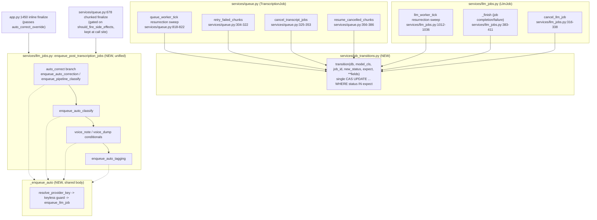

# Unified Proposal — WhisperDeck

Orchestrator synthesis (not delegated). Addresses every duplicated concern from `02-duplication-report.md` that is NOT legitimate specialization. Skips items already ruled out as intentional divergence (LLM-call wrapper policy, migration idioms, voice-id-match discard-by-design, diarization's cancel/rollback logic).

Ordered by leverage: safety fix first, then the two drift-prone mirror pairs, then cleanup.

---

## A. One status-transition primitive for both job queues

**Problem** (duplication report §1): `services/llm_jobs.py` writes every `LlmJob.status` change through an atomic compare-and-set (`_transition`, `llm_jobs.py:350-380`) after PR #389 fixed two real races. `services/queue.py` never got the same fix — its resurrection sweep (`queue.py:818-822`) and `retry_failed_chunks` (`queue.py:304-322`) both do plain read-then-write on `TranscriptionJob.status`, reachable to a lost-update under SQLite's 5s `busy_timeout` lock contention.

**Proposed unified design**: extract `_transition` out of `llm_jobs.py` into a small shared module, `services/job_transitions.py`, as a single function parameterized over the ORM model class:

```python
def transition(db, model_cls, job_id, new_status, *, expect, **fields):
    """UPDATE {table} SET status=?, **fields WHERE id=? AND status IN expect.
    Returns True if the row was updated, False if the expected-status guard failed."""
```

- **Single entry point**: `services.job_transitions.transition(db, TranscriptionJob, job.id, "pending", expect=("failed",), error=None)` and `services.job_transitions.transition(db, LlmJob, job.id, "pending", expect=("failed",), error=None)` — same function, different model class.
- **Call sites that change**:
  - `services/llm_jobs.py:350-380` (`_transition`) becomes a thin wrapper (or is deleted, callers import the shared one directly) — no behavior change, pure extraction.
  - `services/queue.py:818-822` (resurrection sweep): replace the plain `job.status = "pending"` with `transition(db, TranscriptionJob, job.id, "pending", expect=("failed",), error=None)`.
  - `services/queue.py:304-322` (`retry_failed_chunks`): replace the direct field writes with the same call.
  - `services/queue.py:325-353` (`cancel_transcript_jobs`), `356-386` (`resume_cancelled_chunks`): same substitution for consistency, even though today's race there is narrower — one primitive for every status write closes the class of bug, not just the one instance found.
- **Loss of capability**: none. `transition()` returning `False` on a no-op is strictly more informative than the current silent overwrite; callers that don't check the return value today keep working identically for the non-conflicting case.

**Anti-pattern check**: this is not a new abstraction "for flexibility" — it is deleting the second, unsafe implementation of a state-transition SQL statement that already exists correctly in `llm_jobs.py`. No feature flag, no dual path retained.

---

## B. One post-transcription enqueue function

**Problem** (duplication report §2): `app.py:1450-1470` and `services/queue.py:678-709` are a deliberately mirrored 9-line enqueue sequence, each commented "keep in lockstep with the other," and already diverged (one has an `auto_correct` override parameter, the other gates on `should_fire_side_effects`).

**Proposed unified design**: one function, `services/llm_jobs.py: enqueue_post_transcription_jobs(db, transcript, user_settings, *, auto_correct_override=None, gate_on_text_change=None)`:

```python
def enqueue_post_transcription_jobs(db, transcript, user_settings, *, auto_correct_override=None):
    auto_correct = auto_correct_override if auto_correct_override is not None else user_settings.auto_correct
    if auto_correct:
        enqueue_auto_correction(db, transcript, user_settings)
    else:
        enqueue_pipeline_classify(db, transcript)
    enqueue_auto_classify(db, transcript, user_settings)
    if effective_kind(transcript) == "voice_note":
        enqueue_auto_voice_note(db, transcript, user_settings)
    if effective_kind(transcript) == "voice_dump":
        enqueue_auto_voice_dump(db, transcript, user_settings)
    enqueue_auto_tagging(db, transcript, user_settings)
```

- **Call sites that change**:
  - `app.py:1450-1470` becomes `enqueue_post_transcription_jobs(db, transcript, user_settings, auto_correct_override=auto_correct_param)`.
  - `services/queue.py:678-709` becomes `if should_fire_side_effects: enqueue_post_transcription_jobs(db, transcript, user_settings)` — the `should_fire_side_effects` gate stays at the call site since it's specific to the chunked-finalize context (issue #328), not part of the enqueue logic itself.
- **Loss of capability**: none — both existing behaviors (override param, side-effect gate) are preserved, just no longer silently able to drift apart since there's one body.

---

## C. One auto-enqueue helper instead of six near-identical functions

**Problem** (duplication report §4): `services/llm_jobs.py:180-313` — `enqueue_auto_correction`, `enqueue_auto_classify`, `enqueue_auto_voice_note`, `enqueue_auto_voice_dump`, `enqueue_auto_tagging` (and `enqueue_pipeline_classify` for the classify-only path) each repeat: read a settings key → `resolve_provider_key` → keyless-provider guard → `enqueue_llm_job`.

**Proposed unified design**: one private helper, `services/llm_jobs.py: _enqueue_auto(db, transcript, user_settings, *, kind, provider_setting, model_setting)`:

```python
def _enqueue_auto(db, transcript, user_settings, *, kind, provider_setting, model_setting):
    provider = getattr(user_settings, provider_setting)
    model = getattr(user_settings, model_setting)
    api_key, _ = resolve_provider_key(db, transcript.user_id, provider)
    if not api_key and provider not in KEYLESS_PROVIDERS:
        return  # or enqueue with error=, matching each kind's existing no-key behavior
    return enqueue_llm_job(db, transcript.id, kind, provider, model)
```

Each of the five public `enqueue_auto_*` functions becomes a 1-line call: `enqueue_auto_correction = functools.partial(_enqueue_auto, kind="correction", provider_setting="correction_provider", model_setting="correction_model")`, or kept as thin named wrappers for readability/call-site clarity (preferred — the codebase already treats these as separate concepts elsewhere, so keep them addressable by name, just not by copy-pasted body).

- **Call sites that change**: none externally — every existing caller (`app.py`, `services/queue.py`, `services/llm_jobs.py`'s own classification branch) keeps calling `enqueue_auto_correction(...)` etc. by name; only the internals collapse.
- **Loss of capability**: none. Per-kind divergence that's real (e.g. voice_note/voice_dump's `effective_kind` gate) stays in the thin wrapper, not forced into the shared helper.

---

## D. Centralize provider-key/config resolution, fix the one live drift risk

**Problem** (duplication report §5): `resolve_provider_key` is already the correct single source of truth and is used almost everywhere — except `_run_transcription_pipeline` (`app.py:1262-1275`), the single most-executed function in the app, which re-implements the same lookup+decrypt inline against a module-level `SESSION_SECRET` global instead of calling the shared function. Plus two smaller repeated-query patterns.

**Proposed unified design**:
1. `app.py:1262-1275`: delete the inline `ProviderConfig` lookup + decrypt, replace with `api_key, provider_config = resolve_provider_key(db, user.id, provider_name)`. This is a pure behavior-preserving substitution (both currently resolve to the same value) that removes the drift risk on the app's hottest path.
2. New helper `services/settings.py: get_provider_config(db, user_id, name) -> ProviderConfig | None`, replacing the 7 verbatim raw-query sites (`app.py:581,988,1014,1033,1070,1263,3284`).
3. New helper `services/settings.py: require_provider_key(db, user_id, provider) -> str` that resolves the key and raises `HTTPException(400, "...")` with one canonical message, replacing the 4 route-level "resolve + guard + raise 400" blocks (`app.py:2685-2688, 3017-3020, 3045-3048, 3393-3396`) whose error text has already drifted.

**Loss of capability**: none — this is pure deduplication of read-only lookups and error messages; no behavior branches are collapsed.

---

## E. Delete the dead batch-aggregation backend routes

**Problem** (duplication report §6): `GET /api/batches` and `GET /api/batches/{id}` (`app.py:1695-1770`, SQL `GROUP BY` aggregate) have zero frontend callers — confirmed by grep across all of `static/*.js`. The live batch-progress UI is entirely driven by `computeBatchAggregate` (`static/batch_aggregate.js`) over `GET /api/jobs`, using a different status vocabulary.

**Proposed action**: this is not a unification candidate (the two implementations don't even share a vocabulary) — **delete the two dead routes** and their SQL aggregate, or repurpose them as thin wrappers around the same job-list data `computeBatchAggregate` consumes if a backend-side batch-status API is ever genuinely needed again. `tests/test_batch_api.py` (the only caller) would need updating or removal alongside.

**Loss of capability**: none for real users (nothing consumes these routes today). Flag for the user to confirm before deleting, since only they know if the dead routes are a deliberate public API surface for external tooling.

---

## F. (Lower priority, optional) Diarization write-back tail

**Problem** (duplication report §3): the 5-6 line "unpack `diarize_and_merge`'s 3-tuple, write `segments`/`speaker_count`/`diarization_method`" tail repeats at 3 call sites, but the surrounding cancel/rollback logic is genuinely different per call site's concurrency substrate and must NOT be merged.

**Proposed unified design (optional, small)**: a narrow helper `services/diarization.py: apply_diarization_result(transcript, result) -> None` that does only the 3-field assignment (no commit, no cancel-check) — each of the 3 call sites keeps its own commit/rollback/cancel-check wrapper and calls this one-liner in the middle. Marginal win; include only if implementing alongside A-D, not worth a standalone effort.

---

## Combined unified-system flowchart

Shows the two consolidations with the most architectural weight (A: shared transition primitive, B/C: unified enqueue path) as one system.



## What's explicitly NOT touched
- Diarization's cancel/rollback logic per call site (legitimate specialization, item F above is the only optional slice).
- LLM-call wrapper policy divergence (tagging never raises, classification re-raises, etc.) — intentional per-feature error-handling design.
- Two independent queue *architectures* (different job models, different concurrency pools, different dispatch shapes) — not merged into one engine. Only the unsafe state-write primitive is unified (item A); the queues remain conceptually separate because they serve genuinely different workloads (audio chunk dispatch vs. arbitrary LLM job dispatch).
