# WhisperDeck

**Transcribe · Diarize · Summarize · Identify**


WhisperDeck is a self-hosted transcription studio that runs in your browser. Upload audio or video, get a transcript with speaker labels, then clean it up, summarize it, and identify who was talking. Everything runs on your own machine unless you deliberately pick a cloud provider, and it works out of the box with no API key: the default Moonshine provider transcribes locally on CPU.

It's multi-user (register/login, per-user transcripts, settings, and API keys), and every long-running operation goes through a background job queue with live progress, cancel/resume, and retry.

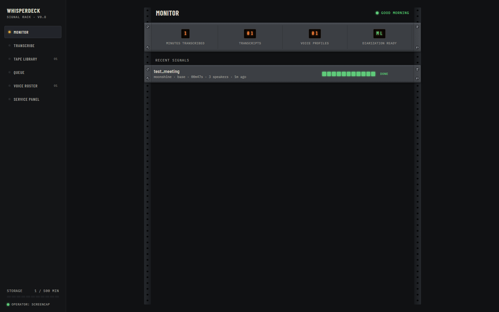

---

## Quick Start

**Windows (from source):**

```cmd
winget install Gyan.FFmpeg

git clone https://github.com/tito13kfm/whisperdeck.git
cd whisperdeck

py -3.13 -m venv .venv
.venv\Scripts\python.exe -m pip install --upgrade pip
.venv\Scripts\python.exe -m pip install -r requirements.txt

run.bat
```

Open http://localhost:9781, register an account, and drop a file on the Transcribe page. The first account you register is automatically the admin.

**Linux/macOS:**

```bash
# install ffmpeg first: apt install ffmpeg / brew install ffmpeg
python3.13 -m venv .venv
source .venv/bin/activate
pip install -r requirements.txt
python app.py
```

**Portable build (Windows, no Python install needed):** `scripts/build_release.ps1` produces a self-contained zip under `dist/` with an embedded Python 3.13 runtime and a static ffmpeg. Unzip anywhere and run.

[INSTALL.md](INSTALL.md) walks through all of this in detail, including the optional diarization and voice-ID extras.

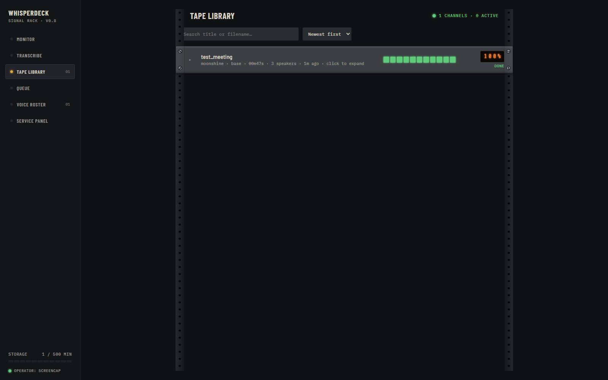

---

## Features

### Transcription providers

| Provider | Runs | API key | Default model | Notes |
|----------|------|---------|---------------|-------|
| **Moonshine** | Local | No | `base` | The default. English-only, fast on CPU, installed by `requirements.txt`. Also: `tiny`, `tiny-streaming`, `small-streaming`, `medium-streaming` |
| **Built-in (faster-whisper)** | Local | No | `tiny` | Multilingual. Optional: `pip install faster-whisper`. Pick `large-v3` for accuracy (slow on CPU) |
| **Groq** | Cloud | Yes (`gsk_`) | `whisper-large-v3-flash` | Free tier, hosted GPUs. Use `whisper-large-v3` for noisy or accented audio |
| **OpenAI** | Cloud | Yes (`sk-`) | `whisper-1` | $0.006/min |
| **Replicate** | Cloud | Yes (`r8_`) | `whisper-large-v3-turbo` | Pay-per-run |
| **OpenRouter** | Cloud | Yes (`sk-or-`) | `openai/whisper-1` | One API for several Whisper hosts |
| **Local / Custom** | Local | Optional | any | Any OpenAI-compatible endpoint (Whisper.cpp, LocalAI, ...) |

On first launch the Transcribe page auto-selects the first provider whose health check passes, which is normally Moonshine. Switch providers and paste API keys under **Settings → Providers**.

Long recordings are split into chunks and processed through the job queue rather than blocking a single request, so a two-hour meeting doesn't tie up the browser tab.

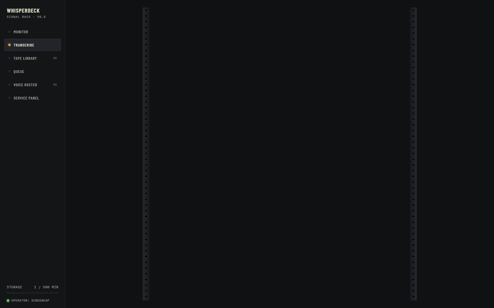

### Speaker diarization

Two modes:

- **Heuristic (default):** alternates speaker labels on pause gaps. No extra dependencies, but it's a guess, and it's unreliable for real meetings.
- **pyannote.audio (recommended):** real ML speaker separation. Install `requirements-diarization.txt` and set a HuggingFace token (steps in [INSTALL.md](INSTALL.md#4-diarization-recommended-pyannoteaudio)).

You can re-diarize an existing transcript at any time; it runs as a `rediarize` job on the Queue screen.

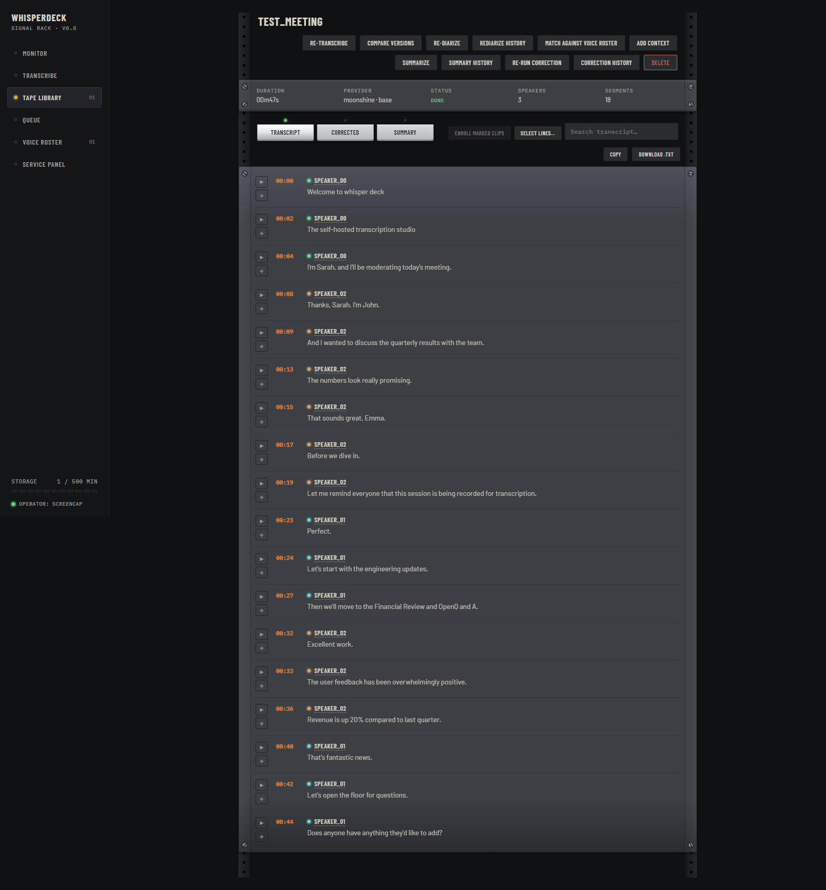

### Voice identification

Enroll a roster of known speakers, each with one or more voice clips, and WhisperDeck relabels matching speakers across a transcript via a `voice_match` job. You can also enroll a speaker directly from a transcript segment you've already identified by ear.

Embedding backends are auto-detected in priority order: **speechbrain** (most accurate, `pip install speechbrain torchaudio`), then **librosa MFCC** (always available, basic). A pyannote.audio-based embedding backend is planned but not yet wired up (see [docs/ROADMAP.md](docs/ROADMAP.md)).

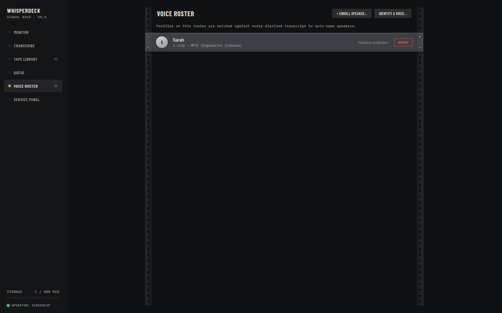

### Hotwords and LLM correction

Keep a per-user glossary of names, jargon, and product terms the model tends to mishear. You can add terms manually or paste a meeting-context document and let the app extract them. The glossary feeds the LLM correction pass that runs after transcription; it does not change the transcription itself.

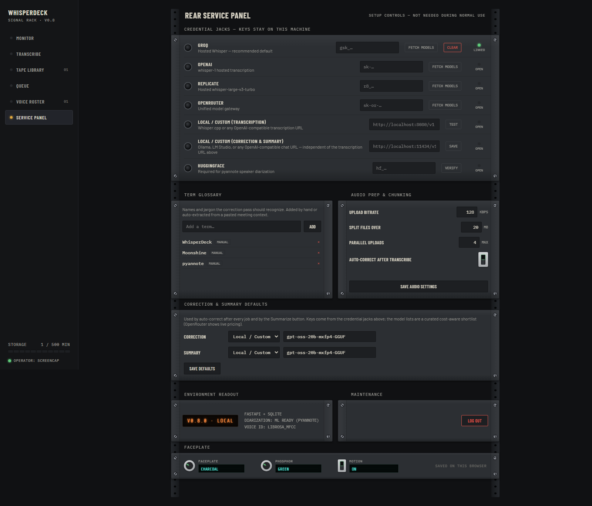

### Correction and summarization

On the transcript detail page, pick an LLM provider (Groq, OpenAI, OpenRouter, or a local Ollama-compatible endpoint) and run:

- **Correct:** fix transcription errors and normalize punctuation, guided by your hotword glossary.
- **Summarize:** generate meeting notes.

Both run as background jobs and reuse the API keys you already saved for transcription.

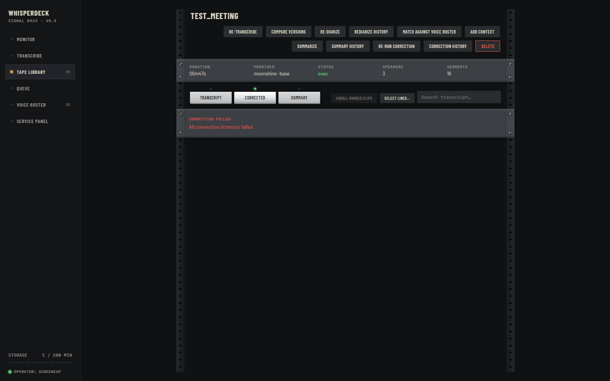

### Run history and versions

Every correction, summary, re-diarization, and voice-match run is recorded per transcript, so you can compare what a correction pass actually changed (word-level diff) or how two summary runs differ. Re-transcribing with a different provider or model creates a linked version chain, letting you A/B providers on the same audio.

### Job queue

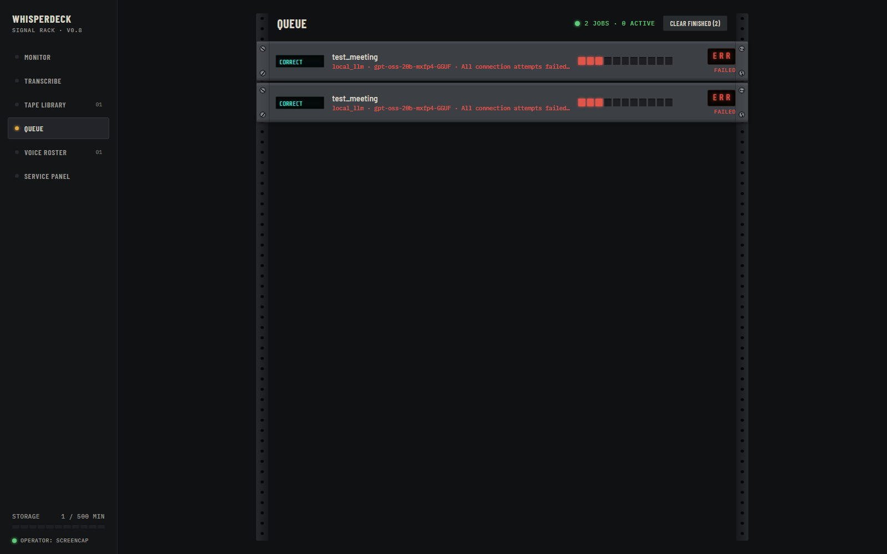

The Queue screen shows every background job (chunked transcription, correction, summary, rediarize, voice match) with live progress. Chunked transcriptions support cancel, resume, and retry-failed-chunks; LLM jobs support rerun and auto-retry on transient failures. Finished jobs can be dismissed one at a time or bulk-cleared without touching the underlying transcripts.

### Accounts and admin

Sessions are cookie-based and the signing secret is generated on first launch and stored in the data directory, so there's no `SECRET_KEY` to configure. Each user's transcripts, settings, and provider keys are isolated.

The first registered user is the admin. Admins can list users, promote or demote other admins, and generate one-time password-reset tokens to hand to a locked-out user (there's no email flow; you share the token yourself). If the admin is the one locked out, `scripts/reset_password.py` resets any password directly against the database from the command line.

### UI themes

The "Signal Rack" chassis has four switchable faceplate finishes — pick one in **Service panel** (or click the faceplate knob in the top bar). Hardware behavior is identical across themes; only the chassis colors change.

| | |
|:---:|:---:|
| 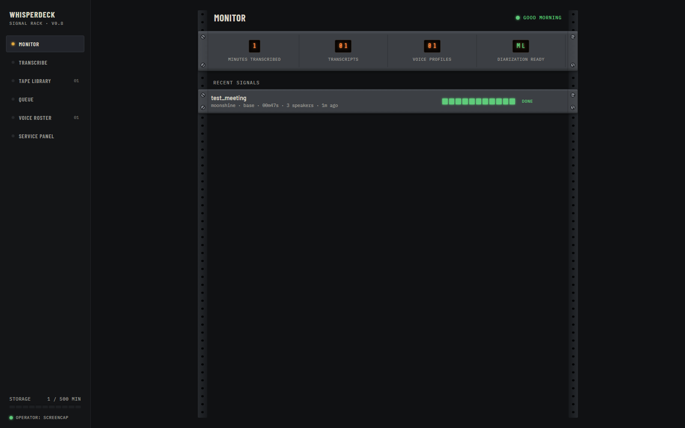 | 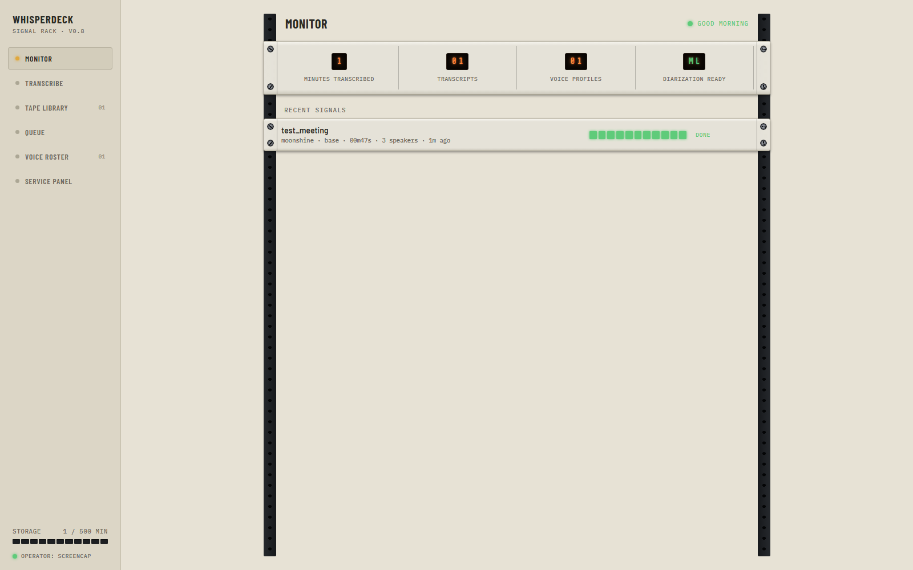 |
| **Charcoal** (default) | **Silverface** |
| 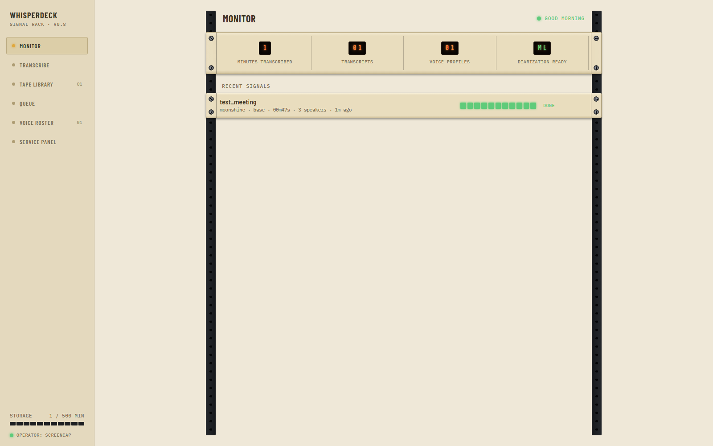 | 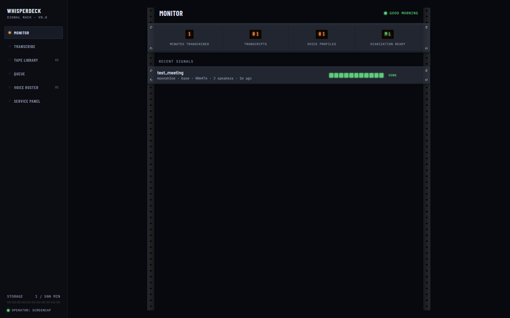 |
| **Champagne** | **Blue-Glass** |

The oscilloscope/LED phosphor also has three color choices (Green, Cyan, Amber) in the same panel.

---

## Configuration

### Environment variables

All optional. The app runs with none of them set.

| Variable | Purpose | Default |
|----------|---------|---------|
| `PORT` | Port to bind | `9781` |
| `WHISPERDECK_DATA_DIR` | Where the SQLite DB, uploads, and session secret live (`WHISPERDESK_DATA_DIR` also accepted) | `./data` |
| `HUGGINGFACE_TOKEN` | pyannote model access, needed for ML diarization | unset |
| `FFMPEG_DIR` | Directory containing ffmpeg, if it's not on PATH | use PATH |
| `WHISPER_CACHE_DIR` | faster-whisper model cache | `~/.cache/whisper` |

There is no `DATABASE_URL`: storage is always local SQLite under the data directory.

### Provider API keys

Paste them in the web UI under **Settings → Providers**. Prefixes are validated on input: Groq `gsk_`, OpenAI `sk-`, Replicate `r8_`, OpenRouter `sk-or-`.

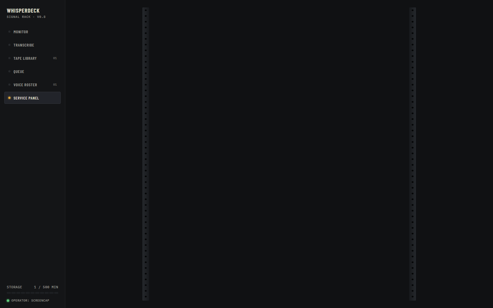

---

## API

The web UI is a single-page app talking to a JSON API, and everything it does you can script. Two things to know before calling it from code:

1. **Fetch a CSRF token first.** `GET /api/csrf-token` returns `{"token": "..."}` and starts a session (cookie). Keep the cookie jar across requests.
2. **Send `X-CSRF-Token` on every mutation.** Every non-`GET` `/api/*` request — including `POST /api/login` and `/api/register` themselves — validates the header against the token issued for its session; a missing or stale token gets a `403`. Fetch a fresh token anytime with `GET /api/csrf-token`; the previous token stays valid until a new one replaces it.

> **Migrating from < 0.8:** scripts that logged in and mutated with cookie auth alone now get `403`. Round-trip a token first:
> ```sh
> # cookie jar keeps the session across requests
> TOKEN=$(curl -sb cookies.txt -c cookies.txt http://localhost:9781/api/csrf-token | jq -r .token)
> curl -sb cookies.txt -c cookies.txt -X POST http://localhost:9781/api/login \
>   -H "Content-Type: application/json" -H "X-CSRF-Token: $TOKEN" \
>   -d '{"username": "you", "password": "..."}'
> curl -sb cookies.txt -c cookies.txt -X PUT http://localhost:9781/api/settings \
>   -H "Content-Type: application/json" -H "X-CSRF-Token: $TOKEN" \
>   -d '{"correction_provider": "local"}'
> ```

| Area | Endpoints |
|------|-----------|
| Auth | `POST /api/register`, `/api/login`, `/api/logout` · `GET /api/me`, `/api/csrf-token` |
| Account recovery | `POST /api/forgot-username` (lists usernames), `/api/forgot-password` (admin: mint reset token), `/api/reset-password` |
| Admin | `GET /api/admin/users` · `POST /api/admin/promote`, `/api/admin/demote` |
| Settings | `GET`/`PUT /api/settings` |
| Providers | `GET /api/providers`, `/api/providers/{name}`, `/api/providers/{name}/models` · `PUT /api/providers/{name}` · `GET /api/correction-models/{provider}` (LLM models for correct/summarize) |
| Transcription | `POST /api/transcribe` · `GET /api/transcripts` · `GET`/`PATCH`/`DELETE /api/transcripts/{id}` · `GET .../audio` · `POST .../retranscribe`, `.../cancel`, `.../resume`, `.../retry-failed-chunks` |
| Transcript tools | `POST .../correct`, `.../summarize`, `.../rediarize`, `.../voice-match`, `.../context` (attach hotword-source doc) · `GET .../summary` |
| Run history | `GET .../runs/{kind}`, `GET .../versions` |
| Speakers | `POST .../speakers/rename`, `.../segments/retag`, `.../enroll-speaker` · `POST /api/diarize` (standalone) |
| Jobs | `GET /api/jobs` · `POST /api/jobs/{id}/cancel`, `.../rerun`, `.../dismiss` · `POST /api/jobs/clear` |
| Voices | `GET /api/voices` · `POST /api/voices/enroll`, `/api/voices/identify` · `POST /api/voices/{id}/clips` · `GET .../clips/{clip_id}/audio` · `DELETE /api/voices/{id}`, `.../clips/{clip_id}` |
| Hotwords | `GET`/`POST /api/hotwords` · `DELETE /api/hotwords/{id}` |
| Meta | `GET /api/health`, `/api/status` |

(`...` abbreviates `/api/transcripts/{id}` or `/api/voices/{id}`.)

---

## Project Structure

```
whisperdeck/
├── app.py                        # FastAPI entry point, all routes
├── run.bat                       # Windows launcher (auto-detects .venv)
├── requirements.txt              # Core deps (includes Moonshine)
├── requirements-diarization.txt  # Optional pyannote extras
├── requirements-browser.txt      # Optional Playwright e2e test extras
├── backends/                     # Transcription providers
│   ├── __init__.py               # Registry & factory
│   ├── base.py                   # BaseProvider abstract class
│   ├── moonshine.py              # Local Moonshine (default)
│   ├── builtin.py                # faster-whisper wrapper
│   └── groq.py / openai.py / replicate.py / openrouter.py / local.py
├── services/
│   ├── audio_prep.py             # ffmpeg transcoding, chunking
│   ├── auth.py                   # Password hashing, sessions, reset tokens, admin
│   ├── correction.py             # LLM transcript correction + context extraction
│   ├── diarization.py            # Heuristic + pyannote diarization
│   ├── hotwords.py               # Per-user glossary (feeds the correction pass)
│   ├── llm_jobs.py               # Correction/summary/rediarize/voice-match jobs
│   ├── model_catalog.py          # Curated LLM model lists with pricing
│   ├── queue.py                  # Chunked-transcription job queue
│   ├── settings.py               # Per-user settings
│   ├── transcription.py          # Inline (non-chunked) transcription
│   └── voice_id.py               # Voice enrollment & identification
├── database/__init__.py          # SQLAlchemy models
├── static/                       # Web UI (vanilla JS + HTML, no framework)
├── scripts/                      # build_release.ps1, reset_password.py, dev helpers
└── tests/                        # pytest suite; tests/e2e/ needs Playwright
```

---

## Development

Run the tests:

```bash
.venv\Scripts\python.exe -m pytest              # unit/API tests, no browser needed
.venv\Scripts\python.exe -m pytest tests/e2e -m e2e   # real-browser tests (see INSTALL.md §7)
```

Adding a transcription provider:

1. Create `backends/newprovider.py` subclassing `BaseProvider`; implement `transcribe()`, `check_health()`, `list_models()`.
2. Register it in `PROVIDER_REGISTRY` in `backends/__init__.py` and add its metadata to `list_providers()`.

Conventions: type hints throughout, async for I/O, services stay framework-free (no FastAPI imports), providers only talk through the `BaseProvider` interface.

The feature roadmap and known accepted gaps live in [docs/ROADMAP.md](docs/ROADMAP.md).

---

## Troubleshooting

| Symptom | Fix |
|---------|-----|
| `ffmpeg not found` | Install ffmpeg and open a new terminal, or set `FFMPEG_DIR` |
| `moonshine-voice not installed` | `pip install -r requirements.txt` (it's a core dep) |
| pyannote import fails | `pip install -r requirements-diarization.txt` and set `HUGGINGFACE_TOKEN` |
| `CUDA out of memory` | Pick a smaller model, or use CPU-only torch |
| Port 9781 in use | Set `PORT`, or stop the other instance |
| `Database locked` | Run only one app instance; SQLite has a single writer |
| Admin locked out | `python scripts/reset_password.py --username <name> --new-password <pass>` |

---

## License

[Hippocratic License 3.0](LICENSE.md), base terms with no additional modules. Permissive like MIT for intellectual property, plus a condition that the software not be used to violate fundamental human rights (see [firstdonoharm.dev](https://firstdonoharm.dev/)). It isn't OSI-approved, since it restricts fields of use — if you're depending on this commercially, check with your legal team first, some won't approve software under a use-restricted license.

## Acknowledgments

- [Moonshine](https://github.com/usefulsensors/moonshine): tiny, fast on-device ASR
- [pyannote.audio](https://github.com/pyannote/pyannote-audio): ML speaker diarization
- [faster-whisper](https://github.com/SYSTRAN/faster-whisper): optimized Whisper inference
- [Groq](https://groq.com/), [OpenAI](https://openai.com/), [Replicate](https://replicate.com/), [OpenRouter](https://openrouter.ai/): cloud inference
- [FastAPI](https://fastapi.tiangolo.com/), [SQLAlchemy](https://www.sqlalchemy.org/), [httpx](https://www.python-httpx.org/): core framework
