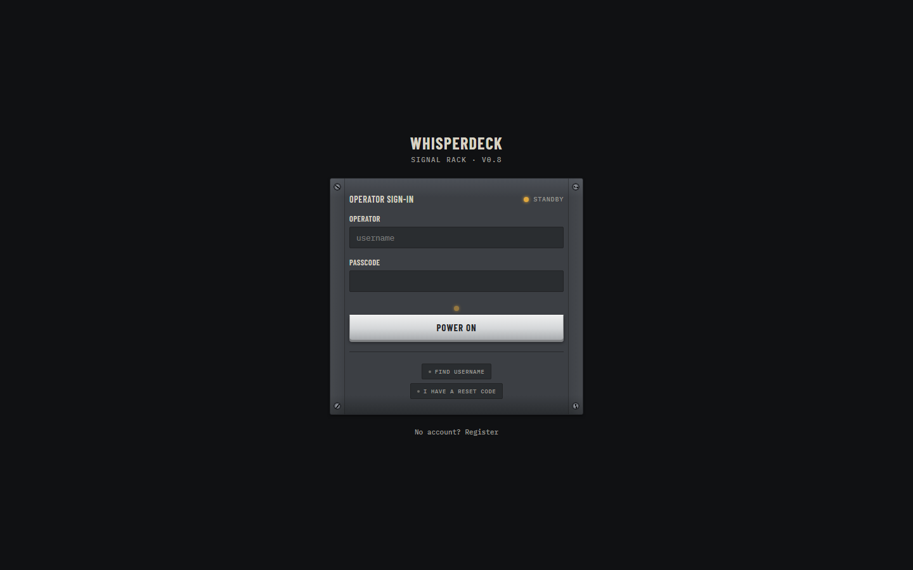
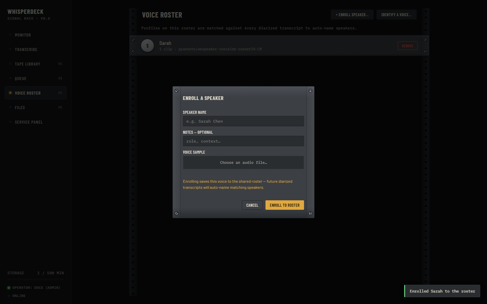
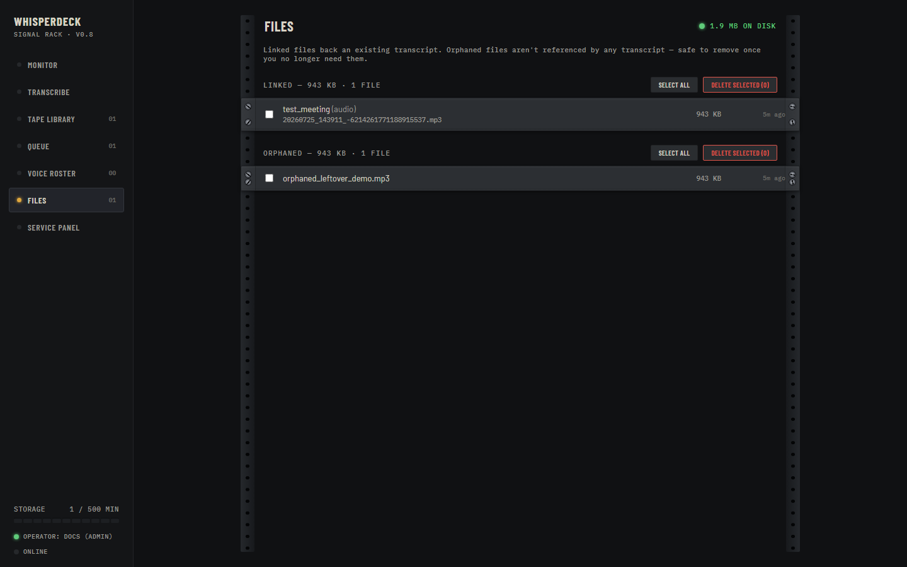

# WhisperDeck User Manual

**Version 0.8**

---

<div style="page-break-before: always"></div>

## Table of Contents

1. [Introduction](#1-introduction)
2. [Installation & Setup](#2-installation--setup)
3. [Getting Started](#3-getting-started)
4. [The Monitor Dashboard](#4-the-monitor-dashboard)
5. [Transcribing Audio](#5-transcribing-audio)
6. [The Transcript Library](#6-the-transcript-library)
7. [Working with Transcripts](#7-working-with-transcripts)
8. [Correction & Summarization](#8-correction--summarization)
9. [Speaker Diarization](#9-speaker-diarization)
10. [Voice Identification](#10-voice-identification)
11. [The Job Queue](#11-the-job-queue)
12. [Hotword Glossary](#12-hotword-glossary)
13. [Service Panel & Settings](#13-service-panel--settings)
14. [UI Themes](#14-ui-themes)
15. [File Management](#15-file-management)
16. [Accounts & Administration](#16-accounts--administration)
17. [API Reference](#17-api-reference)
18. [Configuration Reference](#18-configuration-reference)
19. [Troubleshooting](#19-troubleshooting)

---

<div style="page-break-before: always"></div>

## 1. Introduction

WhisperDeck is a self-hosted transcription studio that runs in your browser. Upload audio or video, get a transcript with speaker labels, then clean it up, summarize it, and identify who was talking. Everything runs on your own machine unless you deliberately pick a cloud provider, and it works out of the box with no API key: the default Moonshine provider transcribes locally on CPU.

It is multi-user (register/login, per-user transcripts, settings, and API keys), and every long-running operation goes through a background job queue with live progress, cancel/resume, and retry.

### Key Concepts

- **Transcript**: A text representation of audio or video content, produced by a transcription provider. Each transcript lives in your Library and can be corrected, summarized, re-diarized, or voice-matched.
- **Provider**: A transcription engine. WhisperDeck ships with Moonshine (local, English-only) and can connect to cloud providers (Groq, OpenAI, Replicate, OpenRouter) or any OpenAI-compatible endpoint.
- **Diarization**: The process of labeling "who spoke when." The default heuristic mode alternates speakers on pause gaps; pyannote.audio provides real ML-based speaker separation.
- **Voice Identification**: Matching known speaker profiles to transcript segments. You enroll a roster of speakers with voice clips, and WhisperDeck automatically labels matching speakers.
- **Hotwords**: A per-user glossary of names, jargon, and product terms the transcription model tends to mishear. Hotwords feed the LLM correction pass.
- **Job Queue**: Every long-running operation (transcription, correction, summary, re-diarization, voice match) runs as a background job with live progress, cancel, resume, and retry.

### System Requirements

- **Python** 3.11--3.13
- **ffmpeg** (for audio/video processing)
- **A modern browser** (Chrome, Firefox, Edge)
- **Windows, Linux, or macOS**

Optional dependencies unlock additional features:
- `faster-whisper` for the Built-in multilingual provider
- `pyannote.audio` for ML diarization
- `speechbrain` + `torchaudio` for high-accuracy voice identification

---

<div style="page-break-before: always"></div>

## 2. Installation & Setup

### Windows (from source)

Install ffmpeg first:

```cmd
winget install Gyan.FFmpeg
```

Then clone and install:

```cmd
git clone https://github.com/tito13kfm/whisperdeck.git
cd whisperdeck
py -3.13 -m venv .venv
.venv\Scripts\python.exe -m pip install --upgrade pip
.venv\Scripts\python.exe -m pip install -r requirements.txt
run.bat
```

### Linux / macOS

```bash
# Install ffmpeg first
# Ubuntu/Debian: sudo apt install ffmpeg
# macOS:         brew install ffmpeg

python3.13 -m venv .venv
source .venv/bin/activate
pip install -r requirements.txt
python app.py
```

### Portable Build (Windows, no Python required)

`scripts/build_release.ps1` produces a self-contained zip under `dist/` with an embedded Python 3.13 runtime and a static ffmpeg. Unzip anywhere and run.

### Optional Components

**Diarization (pyannote.audio):**

```bash
pip install -r requirements-diarization.txt
```

You will also need a HuggingFace token. Set it as the `HUGGINGFACE_TOKEN` environment variable before starting the server.

**Voice Identification (speechbrain):**

```bash
pip install speechbrain torchaudio
```

> See [INSTALL.md](../INSTALL.md) for detailed platform-specific instructions.

### First Launch

After starting the server (via `run.bat` or `python app.py`), open `http://localhost:9781` in your browser. You will see the login page.



**Figure 2-1: The login page**

The first account you register is automatically the admin. Register with any username and password, then log in.

> If you need the server on a different port, set the `PORT` environment variable before launching. If you need the database in a different location, set `WHISPERDECK_DATA_DIR`.

---

<div style="page-break-before: always"></div>

## 3. Getting Started

### The Navigation Rail

After logging in, the application shell appears with a navigation rail on the left side. The rail links to each section of the application:

- **Monitor** - the dashboard, your home screen
- **Transcribe** - upload audio/video and start transcription
- **Bank** - the transcript library
- **Queue** - job progress and management
- **Voices** - the voice roster
- **Files** - disk usage and file management

At the bottom of the rail, a faceplate knob opens the **Service Panel** (settings), and the current theme name is displayed.

Click any rail link to navigate to that section. The current section is highlighted.

### User Interface Conventions

The WhisperDeck interface uses a "Signal Rack" theme - a hardware-inspired design with LED indicators, toggle switches, and panel controls. Throughout this manual:

- **Amber LED** indicates active or busy state
- **Green LED** indicates ready or completed state
- **Toggle switches** toggle features on/off
- **Panel knobs** control settings with click-to-cycle behavior
- **Reel-to-reel deck animation** plays during transcription

---

<div style="page-break-before: always"></div>

## 4. The Monitor Dashboard

The Monitor is your home screen. It gives you an at-a-glance view of your WhisperDeck instance.


**Figure 4-1: The Monitor dashboard**

### Dashboard Sections

**Status Bar**: At the top, a green LED indicator with a greeting ("Good morning," "Good afternoon," "Good evening") confirms the application is running normally.

**Transcripts at a Glance**: Shows how many transcripts you have, grouped by status (completed, in progress, failed). Each status is color-coded and clickable to navigate to the filtered Library view.

**Recent Transcripts**: A scrollable list of your most recent transcripts with filename, duration, and status. Click any entry to open it in the Transcript Detail view.

**Voice Roster Summary**: Shows the number of enrolled speakers. Click to navigate to the Voice Roster page.

**Storage Gauge**: A horizontal bar graph showing disk usage - how much space your transcripts, audio files, and voice clips are using. The bar turns amber as storage grows.

---

<div style="page-break-before: always"></div>

## 5. Transcribing Audio

The Transcribe page is where you turn audio into text. It supports drag-and-drop upload, live microphone recording, and a range of transcription providers.


**Figure 5-1: The Transcribe page**

### Uploading Audio or Video

Drag an audio or video file onto the upload area, or click **Choose a file** to browse. Supported formats include MP3, WAV, M4A, MP4, WEBM, OGG, FLAC, and many others (anything ffmpeg can decode).

Once loaded, the filename and duration display below the upload area. The deck controls activate: Play, Record, and a diarization toggle.

### Selecting a Provider and Model

The provider selector lists all available transcription backends. On first launch, Moonshine is auto-selected if its health check passes. Cloud providers require an API key (configured in the Service Panel).

The model selector refreshes when you change providers, showing only the models that provider supports.

| Provider | Runs | API Key Required | Notes |
|----------|------|-----------------|-------|
| Moonshine | Local | No | Default. English-only, fast on CPU. |
| Built-in (faster-whisper) | Local | No | Multilingual. Optional pip install. |
| Groq | Cloud | Yes (`gsk_`) | Free tier, hosted GPUs. |
| OpenAI | Cloud | Yes (`sk-`) | $0.006/min. |
| Replicate | Cloud | Yes (`r8_`) | Pay-per-run. |
| OpenRouter | Cloud | Yes (`sk-or-`) | Routes to multiple Whisper hosts. |
| Local / Custom | Local | Optional | Any OpenAI-compatible endpoint. |

### Language Selection

The language dropdown restricts the transcription model to a specific language, which improves accuracy. Leave it at "Auto-detect" if the language is unknown or mixed.

### Diarization Toggle

The **DIAR** toggle enables speaker diarization for this transcription. When on, the transcription will label who spoke each segment. If pyannote.audio is installed and a HuggingFace token is configured, it uses ML diarization; otherwise it falls back to heuristic mode (alternating speaker labels on pause gaps).

### Live Recording

Click **REC** (or press the Record key) to start a live microphone recording. A consent dialog appears first:

> This records your microphone (left channel) and system audio (right channel) until you press Stop.

Click **Begin Recording** to start, then **Stop** when done. The recording appears as a loaded file, ready for transcription.

### Starting Transcription

With a file loaded or a recording captured, click **▶** (Play) to start transcription. The reel-to-reel deck animation plays while the job runs. For short recordings under 5 minutes, transcription completes inline. Longer recordings are split into chunks and sent to the Job Queue.

When transcription completes, a **☰ View transcript** button appears. Click it to open the transcript in the Detail view.

---

<div style="page-break-before: always"></div>

## 6. The Transcript Library

The Transcript Library (labeled **Bank** in the navigation rail) lists all your transcripts with search, sort, and per-row actions.


**Figure 6-1: The Transcript Library**

### Library Features

**Search**: Type in the search box to filter transcripts by filename or title. Results update as you type.

**Status Indicators**: Each transcript shows its current status:
- **Green** - completed
- **Amber** - in progress
- **Red** - failed
- **Gray** - cancelled

**Per-Row Actions**: Click a transcript row to reveal action buttons:
- **Open** - navigate to the Transcript Detail view
- **Cancel** - stop a running transcription
- **Resume** - continue a paused transcription
- **Rename** - change the transcript title
- **Delete** - permanently remove the transcript and all associated data

**Sorting**: The library sorts by date by default (newest first). The search box additionally filters in real-time.

**Active Count**: The status bar at the top shows how many transcripts are currently being processed.

---

<div style="page-break-before: always"></div>

## 7. Working with Transcripts

The Transcript Detail page is where you interact with a completed transcript. It shows speaker-labeled segments, offers per-segment audio playback, and provides tabs for viewing the original transcript, corrected version, summary, and (for dictation mode) formatted output.


**Figure 7-1: The Transcript Detail page**

### Page Header

The header shows the transcript title, filename, duration, provider and model used, diarization method, and speaker count. Action buttons at the top right depend on transcript state:

- **Retry failed chunks** - re-run chunks that failed during chunked transcription
- **Re-transcribe** - run a new transcription with different provider/model settings (creates a linked version chain)
- **Correct** - run LLM correction (see Chapter 8)
- **Summarize** - generate meeting notes (see Chapter 8)
- **Re-diarize** - re-run speaker diarization (see Chapter 9)
- **Voice match** - identify speakers against the voice roster (see Chapter 10)
- **Delete** - permanently remove the transcript

### Segments Panel

Each segment shows:
- **Speaker label** (e.g., "Speaker 1", "Alice")
- **Timestamp** (start and end time)
- **Text** - the transcribed words
- **Play button** - plays that segment's audio

**Renaming a speaker**: Click a speaker label to type a new name. All segments with that label update immediately.

**Retagging segments**: Select one or more segments (click to select, click again to deselect) and use the **Re-tag** button to assign them to a different speaker.

**Enrolling a speaker**: Select segments and click **Enroll** to add them as voice clips to a speaker profile in the Voice Roster.

### Tabs

The Detail page has four tabs beneath the header:

- **Transcript** - the original transcription with speaker labels
- **Corrected** - the LLM-corrected version (appears after running a correction job)
- **Summary** - generated meeting notes (appears after running a summarization job)
- **Format** - (dictation mode only) reformatted output

Switch between tabs to compare the original transcript against corrections or summaries.


**Figure 7-2: The Corrected tab showing an LLM-corrected transcript**

### Run History

Every correction, summary, re-diarization, and voice-match run is recorded per transcript. Click **Versions** in the header to view the version chain, or use the **Compare** button on the Corrected/Summary tabs to see word-level diffs between runs.

<!-- TODO: capture version compare modal screenshot -->

### Floating Video Panel

If the source file contains a video stream, a floating video panel appears. You can position it independently of the transcript view, which is useful for manually identifying speakers by sight.

---

<div style="page-break-before: always"></div>

## 8. Correction & Summarization

After transcription, WhisperDeck can improve the text and generate summaries using an LLM (Large Language Model). Both operations run as background jobs.

### LLM Providers

Correction and summarization use the same LLM providers configured in the Service Panel. Supported providers:

- **Groq** - fast, free tier available
- **OpenAI** - GPT models
- **OpenRouter** - routes to multiple LLM providers
- **Local** - any Ollama-compatible endpoint (e.g., a local Ollama instance)

Provider API keys are shared with the transcription providers where applicable (Groq, OpenAI, OpenRouter). The **Local** provider connects to `http://localhost:11434` by default.

### Running a Correction

On the Transcript Detail page, click **Correct**. A dialog lets you pick an LLM provider and model. Click **Run** to start.

The correction pass:
1. Normalizes punctuation and capitalization
2. Fixes words that match your hotword glossary (see Chapter 12)
3. Improves grammar and readability

Progress shows on the Corrected tab and in the Job Queue. When complete, the corrected text appears in the Corrected tab.

### Running a Summary

On the Transcript Detail page, click **Summarize**. Pick a provider and model, then click **Run**.

The summary job generates meeting notes from the transcript. The result appears in the Summary tab when complete.

### Context Documents

Before running a correction or summary, you can attach a **context document** - a meeting agenda, slide deck text, or any document that provides domain context. The LLM uses this context to improve accuracy.

On the Transcript Detail page, click **Context**, paste or type the document text, and click **Attach**. The document is included in the next correction or summary job for this transcript.

### Run History and Version Comparison

Every correction and summary run is recorded. You can:
- View all past runs for a transcript under the respective tab
- Compare two runs word-by-word to see exactly what changed
- Re-run with different providers or models to find the best result

Re-transcribing with a different provider or model creates a linked version chain, letting you A/B test providers on the same audio.

---

<div style="page-break-before: always"></div>

## 9. Speaker Diarization

Diarization is the process of labeling "who spoke when" in a transcript. WhisperDeck offers two methods.

### Heuristic Diarization (Default)

The default mode alternates speaker labels on detected pause gaps. It requires no extra dependencies and runs automatically during transcription when the **DIAR** toggle is on.

**Limitations**: Heuristic diarization is a guess. It cannot distinguish real speakers, only detect silences. For meetings with more than two speakers or overlapping speech, results will be unreliable.

### pyannote.audio (Recommended)

pyannote.audio is a real machine-learning speaker separation model. It identifies distinct voice patterns and assigns segments to actual speakers.

**Setup**:

1. Install the optional dependencies:
   ```bash
   pip install -r requirements-diarization.txt
   ```
2. Obtain a HuggingFace token (free, requires accepting pyannote's license terms at huggingface.co)
3. Set the `HUGGINGFACE_TOKEN` environment variable before starting the server

When pyannote is available, the **DIAR** toggle uses it automatically. The diarization method is recorded in the transcript header.

### Re-Diarizing an Existing Transcript

You can re-diarize a transcript at any time. On the Transcript Detail page, click **Re-diarize** to start a `rediarize` job. This is useful when:
- You transcribed without diarization and want to add speaker labels later
- The heuristic result was poor and you have since installed pyannote
- You want to try a different number of speakers

Re-diarization runs as a background job on the Queue screen.

---

<div style="page-break-before: always"></div>

## 10. Voice Identification

Voice identification matches known speaker profiles to transcript segments. Once enrolled, WhisperDeck can automatically label speakers across any transcript.


**Figure 10-1: The Voice Roster page**

### The Voice Roster

The Voice Roster lists all enrolled speakers. Each profile shows:
- **Speaker name**
- **Number of voice clips**
- **Enrollment date**

Click a profile to expand it and see individual clips. Each clip can be played or deleted.

### Enrolling a Speaker

There are two ways to enroll a speaker:

**From any page**: Navigate to the Voice Roster page and click **Enroll**. Name the speaker and upload one or more audio files containing only that speaker's voice. Click **Save**.

**From a transcript**: On the Transcript Detail page, select segments you have manually identified as belonging to a specific speaker. Click **Enroll**, name the speaker, and click **Save**. The selected segments become voice clips for that profile.



**Figure 10-2: The Enroll Speaker dialog**

### Running Voice Match

After enrolling at least one speaker, navigate to a transcript's Detail page and click **Voice Match**. The job compares every segment against all enrolled voice profiles and relabels matching segments. Progress shows on the Queue screen.

### Adding Clips to an Existing Profile

On the Voice Roster page, click a speaker profile, then click **Add Clip**. Upload another audio file or record live audio. More clips improve matching accuracy.

### Embedding Backends

WhisperDeck auto-detects the best available embedding backend:

1. **speechbrain** (most accurate) - requires `pip install speechbrain torchaudio`
2. **librosa MFCC** (basic, always available) - works without extra dependencies but is less accurate

The active backend is shown in the health check at `/api/health`.

---

<div style="page-break-before: always"></div>

## 11. The Job Queue

The Queue screen shows every background job with live progress, cancel/resume/retry controls, and bulk management.


**Figure 11-1: The Job Queue page**

### Job Types

| Job Type | Description | Cancelable | Rerunnable |
|----------|-------------|------------|------------|
| Transcription | Chunked transcription (files > 5 min) | Yes, per-chunk | Retry failed chunks |
| Correction | LLM transcript correction | Yes | Yes |
| Summary | LLM meeting summary | Yes | Yes |
| Rediarize | Re-running speaker diarization | Yes | Yes |
| Voice Match | Matching speakers against roster | Yes | Yes |

### Job States

- **Pending** - queued, waiting for a worker slot
- **Running** - actively processing, with progress indicator
- **Completed** - finished successfully
- **Failed** - terminated with an error (hover for details)
- **Cancelled** - stopped by user

### Job Controls

Each job card shows:
- **LED progress bar** - for chunked transcriptions, each chunk lights up as it completes (green = done, amber = running, red = failed)
- **Section counter** - "section 3 of 12" for chunked jobs
- **Duration** - how long the job has been running
- **Pipeline info** - provider and model used

Action buttons appear based on job state:
- **Cancel** - stop a running job
- **Resume** - continue a paused/cancelled transcription
- **Retry failed chunks** - re-run only the chunks that failed
- **Rerun** - start the job over (LLM jobs only)
- **Dismiss** - remove a finished job from the queue

### Bulk Actions

At the bottom of the Queue page:

- **Clear finished** - removes all completed, failed, and cancelled jobs from the queue without affecting the underlying transcripts

### Queue Polling

The Queue page polls for updates every 3 seconds while active. When navigating away, a global watcher continues monitoring LLM jobs (correction, summary) and shows toast notifications when they complete, so you can work elsewhere and still know when results are ready.

---

<div style="page-break-before: always"></div>

## 12. Hotword Glossary

The hotword glossary is a per-user list of names, jargon, and product terms that the transcription model tends to mishear. The glossary feeds the LLM correction pass - it does not change the transcription itself.


**Figure 12-1: The Hotword Glossary on the Service Panel**

### Adding Hotwords

On the Service Panel (**Settings** in the navigation rail), scroll to the Hotwords section. Type a term and click **Add** (or press Enter). Each term appears in the list below.

Examples of useful hotwords:
- People's names the model consistently gets wrong ("Alicia" → "Alisha")
- Domain jargon ("PyAnnote" → "Piano")
- Product names ("WhisperDeck" → "Whisper Deck")
- Acronyms that should stay capitalized ("API", "CSRF")

### Deleting Hotwords

Click the ✕ next to any hotword to remove it from your glossary.

### Context Documents

You can also attach context documents to individual transcripts (see Chapter 8, "Context Documents"). The LLM receives both your hotword glossary and the transcript-specific context document during correction.

---

<div style="page-break-before: always"></div>

## 13. Service Panel & Settings

The Service Panel (labeled **Settings** in the navigation rail) is the configuration center for WhisperDeck. It controls providers, API keys, themes, and hotwords.


**Figure 13-1: The Service Panel**

### Provider Configuration

Each transcription provider has a section with:
- **API Key field** - paste your key here. Validated on input (prefix check: Groq `gsk_`, OpenAI `sk-`, Replicate `r8_`, OpenRouter `sk-or-`)
- **Default Model** - the model used when no specific model is chosen on the Transcribe page
- **Health indicator** - shows whether the provider is reachable

Cloud providers require an API key before they can be used. Local providers (Moonshine, Built-in) work without keys.

### LLM Provider Configuration

The same providers used for transcription (Groq, OpenAI, OpenRouter) can also serve LLM requests for correction and summarization. Additionally, the **Local** provider connects to any Ollama-compatible endpoint at `http://localhost:11434/v1` by default.

Configure the LLM provider and default model under **Settings → LLM**.

### Faceplate & Phosphor Theme

The **Faceplate** selector changes the chassis color theme. See Chapter 14 for details and screenshots.

The **Phosphor** selector changes the LED and oscilloscope color between Green, Cyan, and Amber.

---

<div style="page-break-before: always"></div>

## 14. UI Themes

WhisperDeck ships with four "faceplate" themes and three phosphor colors. Themes only change the visual appearance - all hardware behavior is identical across themes.

### Faceplate Themes

| | |
|:---:|:---:|
|  |  |
| **Charcoal** (default) | **Silverface** |
|  |  |
| **Champagne** | **Blue-Glass** |

**Figure 14-1: The four faceplate themes**

### Changing Themes

There are two ways to switch themes:

1. **Service Panel**: Open Settings and select a faceplate from the dropdown
2. **Faceplate Knob**: Click the knob icon in the lower-left corner of the navigation rail to cycle through themes

The theme choice is saved per-user and persists across sessions.

### Phosphor Colors

The phosphor color affects all LED indicators, the oscilloscope, and other illuminated elements. Three options are available:
- **Green** (default) - classic oscilloscope green
- **Cyan** - blue-green tint
- **Amber** - warm orange glow

Change the phosphor color in the Service Panel under **Phosphor**.

---

<div style="page-break-before: always"></div>

## 15. File Management

The Files page shows everything WhisperDeck has stored on disk - transcripts, audio files, voice clips, and any orphaned files that are no longer linked to a transcript.



**Figure 15-1: The File Inventory page**

### Linked vs. Orphaned Files

- **Linked files** are associated with an active transcript in your Library
- **Orphaned files** were left behind after a transcript was deleted, or were uploaded but never used

The storage bar at the top shows total disk usage and the breakdown between linked and orphaned files.

### Deleting Files

You can delete individual files or entire categories:
- **Delete orphaned files** - reclaims disk space from files no longer associated with any transcript
- **Delete a specific file** - removes a single linked file (this breaks the associated transcript)

> **Caution**: Deleting a linked file removes the audio source for that transcript. Playback and re-transcription will no longer work.

### Storage Location

All files are stored under the data directory, controlled by the `WHISPERDECK_DATA_DIR` environment variable (default: `./data`). The directory structure:

```
data/
├── whisperdesk.db       # SQLite database
├── uploads/             # Original uploaded audio/video
├── transcripts/         # Processed transcript JSON
├── voices/              # Voice clip audio
└── .session_secret      # Session signing key
```

---

<div style="page-break-before: always"></div>

## 16. Accounts & Administration

WhisperDeck is multi-user. Each user has their own transcripts, settings, and API keys. Sessions are cookie-based with CSRF protection.

### Registration and Login

On first launch, navigate to `http://localhost:9781`. The login page offers **Register** and **Sign In** options. The first registered user is automatically the admin.

### User Management (Admin Only)

Admins can manage users from the Service Panel. The **Admin** section shows a list of all registered operators.

**Promoting a user**: Click **Promote** next to any non-admin user to grant admin privileges.

**Demoting a user**: Click **Demote** next to any admin (other than yourself) to revoke admin privileges.

### Password Reset

There is no email flow. Password resets work through shared tokens:

**If an operator is locked out**: An admin can generate a one-time password-reset token from the Admin panel. Give the token to the locked-out user, who enters it on the login screen to set a new password.

**If the admin is locked out**: Run the command-line reset tool:

```bash
python scripts/reset_password.py --username <name> --new-password <pass>
```

### Session Management

- Sessions are cookie-based with a signing secret generated on first launch
- The secret lives in `data/.session_secret` - never share this file
- There is no `SECRET_KEY` to configure; it is auto-generated
- CSRF tokens protect all mutation endpoints (see Chapter 17)

### Data Isolation

Each user's data is fully isolated:
- Transcripts belong to one user
- Settings, hotwords, and API keys are per-user
- Voice roster profiles are per-user (enrolled speakers are scoped to the user who enrolled them)
- Admin functions span all users

---

<div style="page-break-before: always"></div>

## 17. API Reference

The web UI is a single-page application talking to a JSON API. Everything the UI does, you can script.

### Authentication

All mutation endpoints require a CSRF token:

1. **Fetch a CSRF token**: `GET /api/csrf-token` returns `{"token": "..."}` and starts a session (cookie). Keep the cookie jar across requests.
2. **Send `X-CSRF-Token` on every mutation**: Every non-`GET` `/api/*` request (including `/api/login` and `/api/register`) validates the header against the token issued for its session. A missing or stale token returns `403`.

```sh
# Example: login via curl
TOKEN=$(curl -sb cookies.txt -c cookies.txt http://localhost:9781/api/csrf-token | jq -r .token)
curl -sb cookies.txt -c cookies.txt -X POST http://localhost:9781/api/login \
  -H "Content-Type: application/json" -H "X-CSRF-Token: $TOKEN" \
  -d '{"username": "you", "password": "..."}'
```

### Endpoint Reference

| Area | Method | Endpoint | Description |
|------|--------|----------|-------------|
| **Auth** | `POST` | `/api/register` | Register a new user |
| | `POST` | `/api/login` | Sign in |
| | `POST` | `/api/logout` | Sign out |
| | `GET` | `/api/me` | Current user info |
| | `GET` | `/api/csrf-token` | Fetch CSRF token |
| **Recovery** | `POST` | `/api/forgot-username` | List usernames |
| | `POST` | `/api/forgot-password` | Admin: mint reset token |
| | `POST` | `/api/reset-password` | Reset with token |
| **Admin** | `GET` | `/api/admin/users` | List all users |
| | `POST` | `/api/admin/promote` | Promote to admin |
| | `POST` | `/api/admin/demote` | Demote from admin |
| **Settings** | `GET`/`PUT` | `/api/settings` | User settings |
| **Providers** | `GET` | `/api/providers` | List providers |
| | `GET` | `/api/providers/{name}` | Provider details |
| | `PUT` | `/api/providers/{name}` | Update provider config |
| | `GET` | `/api/providers/{name}/models` | Available models |
| | `GET` | `/api/correction-models/{provider}` | LLM models for correct/summarize |
| **Transcription** | `POST` | `/api/transcribe` | Start transcription |
| | `GET` | `/api/transcripts` | List transcripts |
| | `GET` | `/api/transcripts/{id}` | Get transcript |
| | `PATCH` | `/api/transcripts/{id}` | Update transcript |
| | `DELETE` | `/api/transcripts/{id}` | Delete transcript |
| | `GET` | `/api/transcripts/{id}/audio` | Stream audio |
| | `GET` | `/api/transcripts/{id}/video` | Stream video |
| | `POST` | `/api/transcripts/{id}/cancel` | Cancel transcription |
| | `POST` | `/api/transcripts/{id}/resume` | Resume transcription |
| | `POST` | `/api/transcripts/{id}/retry-failed-chunks` | Retry failed chunks |
| | `POST` | `/api/transcripts/{id}/retranscribe` | Re-transcribe |
| **Tools** | `POST` | `/api/transcripts/{id}/correct` | Run LLM correction |
| | `POST` | `/api/transcripts/{id}/summarize` | Run LLM summary |
| | `POST` | `/api/transcripts/{id}/rediarize` | Re-diarize |
| | `POST` | `/api/transcripts/{id}/voice-match` | Voice match |
| | `POST` | `/api/transcripts/{id}/format/{target}` | Reformat (dictation) |
| | `POST` | `/api/transcripts/{id}/context` | Attach context doc |
| | `GET` | `/api/transcripts/{id}/summary` | Get summary |
| **Speakers** | `POST` | `/api/transcripts/{id}/speakers/rename` | Rename speaker |
| | `POST` | `/api/transcripts/{id}/segments/retag` | Re-tag segments |
| | `POST` | `/api/transcripts/{id}/relabel-undo` | Undo speaker relabel |
| | `POST` | `/api/transcripts/{id}/enroll-speaker` | Enroll from segments |
| | `POST` | `/api/diarize` | Standalone diarize |
| **History** | `GET` | `/api/transcripts/{id}/runs/{kind}` | Run history |
| | `GET` | `/api/transcripts/{id}/versions` | Version chain |
| **Jobs** | `GET` | `/api/jobs` | List jobs |
| | `POST` | `/api/jobs/{id}/cancel` | Cancel job |
| | `POST` | `/api/jobs/{id}/rerun` | Rerun job |
| | `POST` | `/api/jobs/{id}/dismiss` | Dismiss job |
| | `POST` | `/api/jobs/clear` | Clear finished jobs |
| **Voices** | `GET` | `/api/voices` | List voice profiles |
| | `POST` | `/api/voices/enroll` | Enroll speaker |
| | `POST` | `/api/voices/identify` | Identify speaker |
| | `DELETE` | `/api/voices/{id}` | Delete profile |
| | `POST` | `/api/voices/{id}/clips` | Add clip |
| | `DELETE` | `/api/voices/{id}/clips/{cid}` | Delete clip |
| | `GET` | `/api/voices/{id}/clips/{cid}/audio` | Stream clip |
| **Hotwords** | `GET` | `/api/hotwords` | List hotwords |
| | `POST` | `/api/hotwords` | Add hotword |
| | `DELETE` | `/api/hotwords/{id}` | Delete hotword |
| **Files** | `GET` | `/api/files` | File inventory |
| | `POST` | `/api/files/delete` | Delete files |
| **Meta** | `GET` | `/api/health` | Health check |
| | `GET` | `/api/status` | Server status |

Where `{id}` in transcript endpoints is the transcript ID, and in voice endpoints is the voice profile ID.

---

<div style="page-break-before: always"></div>

## 18. Configuration Reference

### Environment Variables

All environment variables are optional. The application runs with none set.

| Variable | Purpose | Default |
|----------|---------|---------|
| `PORT` | Port to bind | `9781` |
| `WHISPERDECK_DATA_DIR` | Database, uploads, and session secret location | `./data` |
| `WHISPERDESK_DATA_DIR` | Legacy alias for `WHISPERDECK_DATA_DIR` | (deprecated) |
| `HUGGINGFACE_TOKEN` | pyannote.audio model access token | unset |
| `FFMPEG_DIR` | Directory containing ffmpeg binary | use PATH |
| `WHISPER_CACHE_DIR` | faster-whisper model cache directory | `~/.cache/whisper` |

`WHISPERDECK_DATA_DIR` is the correct spelling. The legacy `WHISPERDESK_DATA_DIR` still works but prints a deprecation warning.

### Data Directory Structure

```
{WHISPERDECK_DATA_DIR}/
├── whisperdesk.db       # SQLite database (all transcripts, users, settings)
├── .session_secret      # Auto-generated session signing key
├── uploads/             # Original uploaded audio/video files
├── transcripts/         # Serialized transcript JSON
└── voices/              # Voice clip audio for enrolled speakers
```

### Provider API Keys

Paste API keys in the web UI under **Settings → Providers**. Each provider validates the key prefix:

| Provider | Prefix |
|----------|--------|
| Groq | `gsk_` |
| OpenAI | `sk-` |
| Replicate | `r8_` |
| OpenRouter | `sk-or-` |

Keys are encrypted at rest in the database.

### Session Secret

On first launch, WhisperDeck generates a random 32-byte hex secret and writes it to `{DATA_DIR}/.session_secret`. This secret signs all session cookies. Do not share it or commit it to version control.

If the secret file is deleted, a new one is generated on the next launch, invalidating all existing sessions. All users will need to log in again.

---

<div style="page-break-before: always"></div>

## 19. Troubleshooting

| Symptom | Likely Cause | Fix |
|---------|-------------|-----|
| `ffmpeg not found` | ffmpeg not installed or not on PATH | Install ffmpeg and restart the terminal, or set `FFMPEG_DIR` |
| `moonshine-voice not installed` | Core dependency missing | `pip install -r requirements.txt` |
| pyannote import fails | Optional dependency not installed | `pip install -r requirements-diarization.txt` and set `HUGGINGFACE_TOKEN` |
| `CUDA out of memory` | GPU memory exhausted | Switch to a smaller model, or set torch to CPU-only |
| Port 9781 already in use | Another instance running | Set `PORT` to a different value, or stop the other instance |
| `Database locked` | Multiple instances sharing the same database | Run only one instance; SQLite has a single writer |
| Admin locked out | Lost admin password | Run `python scripts/reset_password.py --username <name> --new-password <pass>` |
| Transcription stuck or silent | Provider health check failed | Check the provider configuration in Settings; test with Moonshine (always local) |
| CSRF token errors | Script not fetching token before mutation | Call `GET /api/csrf-token` first and send `X-CSRF-Token` header on all non-GET requests |
| Long audio times out | Chunking pipeline misconfigured | Files over 5 minutes are automatically chunked; check the Queue for failed chunks |
| "No API key" warning on Transcribe | Cloud provider selected without key | Switch to Moonshine (no key needed) or paste your API key in Settings |
| Theme not saving | Browser local storage issue | Theme choice is saved per-user in the database; check that cookies/sessions are working |
| Zero users on existing database | Wrong `WHISPERDECK_DATA_DIR` | Check the console for a data-safety warning; set `WHISPERDECK_DATA_DIR` to the correct path |
| Voice match results poor | Insufficient voice clips per speaker | Enroll 3+ clips per speaker (30+ seconds each) for best accuracy; use speechbrain backend |

### Diagnostic Information

**Health Check**: `GET /api/health` returns:
```json
{
  "status": "ok",
  "diarization_backend": "pyannote" | "heuristic",
  "voice_id_backend": "speechbrain" | "librosa"
}
```

**Provider Status**: `GET /api/providers` returns each provider's health and configuration status.

**Logs**: Server output goes to stdout. Watch the console window for errors, health check results, and migration messages.

---

<div style="page-break-before: always"></div>

## Index

- Accounts, 16
- Admin, 16
- API keys, 13, 18
- API reference, 17
- Bank (Transcript Library), 6
- Configuration, 18
- Context documents, 8
- Correction (LLM), 8
- Dashboard (Monitor), 4
- Data directory, 18
- Diarization, 5, 9
- Environment variables, 18
- Faceplate themes, 14
- File management, 15
- Floating video panel, 7
- Hotword glossary, 12
- Installation, 2
- Job queue, 11
- Live recording, 5
- LLM providers, 8, 13
- Login, 3, 16
- Monitor, 4
- Navigation rail, 3
- Password reset, 16
- Phosphor colors, 14
- Providers (transcription), 5, 13
- Queue, 11
- Registration, 16
- Run history, 7, 8
- Service panel, 13
- Settings, 13
- Speaker diarization, 9
- Summarization, 8
- Themes, 14
- Transcript detail, 7
- Transcript library, 6
- Transcription, 5
- Troubleshooting, 19
- User management, 16
- Version comparison, 7, 8
- Voice identification, 10
- Voice roster, 10
